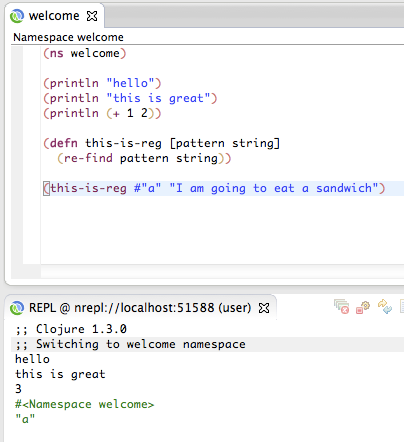

Welcome to Clojure, through Leiningen
-----------------

This book is about sharing my love for Clojure, why I use it, and why I will keep using it for a fair bit of time. You don't need to be a great IT geek, you just have to start using Clojure. Here we go.

### Clojure
[http://learn-clojure.com/clojure_tutorials.html](http://learn-clojure.com/clojure_tutorials.html)

I will not go too much into the first steps details, since this is not the aim of this book. There is a completely new online book written by [John](http://www.unexpected-vortices.com/clojure/brief-beginners-guide/index.html) that should get all the attention it deserves.

Do not forget to do a few [clojure koans](https://github.com/functional-koans/clojure-koans) to make sure the basic and the roots are ok.

I have added a few trips and ticks in the 00_zero.clj file (in the samples), so feel free to go along and try it by yourself, once you have read the next section about how to get started with clojure.

Last one, if you get lost on your journey, be sure to refer to the [cheatsheet](http://clojuredocs.org/quickref/Clojure%20Core).

### Leiningen 
[https://github.com/technomancy/leiningen](https://github.com/technomancy/leiningen)

To start using clojure, you actually do not install it. You start by installing Leiningen. Once you have it installed, you should be able to see the following:

@@@ ruby 01_leiningen.sh @@@

Now if you just want to start using some live clojure, you just go with:

@@@ ruby 02_leiningen.sh @@@

And there you are. Was simple no ? 

And here is your mother of them all hello world 

@@@ ruby 03_hello.clj @@@

Now you have to realize that all the libs available to the Java World through Maven repositories, and all the libs hosted on Clojars can be integrated in the project in no time by using the command:

*lein deps*

The libraries will come to your local project folder. Let's hack in no time.

#### Search clojars

To search a library online, use the following syntax:
<code>
	lein search <libraryname>
</code>

For example
<code>
	lein search jsoup     
</code>
will return 

<code>
<pre>
 == Results from clojars - Showing page 1 / 1 total
[org.clojars.clizzin/jsoup "1.5.1"] jsoup HTML parser
</pre>
</code>

#### Upload to clojars
There is a plugin called [lein-clojars](https://github.com/ato/lein-clojars)

You install it somehow like this:
<code>
	lein plugin install lein-clojars 0.9.1
</code>

Then in a clojure project, just go and upload it with
<code>
	lein push
</code>
Nothing else.

Then a lein search will (should) show it. 

### Working from Eclipse
[http://code.google.com/p/counterclockwise/](http://code.google.com/p/counterclockwise/)

The plugin Counterclockwise install without glitches on modern Eclipse environment. 

The real reason you want to have eclipse running is for its awesome auto completion and integrated documentation. Start typing and see it in action:

#### Examples

All the examples in this book can be run with a command like:
<code>
(load-file "code/18_clojure_soup.clj")
</code>

If you can not run them, let me know ;) 

### Jark
[http://icylisper.in/jark/started.html](http://icylisper.in/jark/started.html)

Next you probably going to get tired of the Java VM so very slow startup time. Here comes [nrepl](https://github.com/clojure/tools.nrepl) and [Jark](http://icylisper.in/jark/features.html)

Create a new leiningen project, and follow the jark install steps:

@@@ ruby 04_jark.clj @@@

and then start the repl with the new code from core.clj

@@@ ruby 05_jark.sh @@@

And now straight from the shell you can use and run remote clojure code

@@@ ruby 06_jark_sample.sh @@@

Now that is some sweet fast starting time, so stop buzzing around.

### Pomegrenate
[https://github.com/cemerick/pomegranate](https://github.com/cemerick/pomegranate)

This is the best way to add libraries at runtime. You still need the library itself to be available to the repl, by adding this to your __project.clj__ file:

<code>
	[com.cemerick/pomegranate "0.0.13"]
</code>

Then, here is how to import incanter in a running REPL session:

@@@ ruby 11_pomegranata.clj @@@

### Scala Integration

Since every source file in a lein project can be integrated, you can use the [scalac-plugin](https://github.com/technomancy/lein-scalac)

Here is the HelloWorld.scala file:

@@@ ruby 24_scala.scala @@@

and here is how you call it from Clojure

@@@ ruby 23_scala.clj @@@

Now you can tell your friend you know more than one language on the JVM. :)

### Java Integration

Note that the scala integration right above is also supported by the original java. This is actually built in leiningen. Here is how you put it together just in case:

@@@ ruby 30_java.clj @@@

This is actually very good to keep old sources ready to be migrated, or actually the whole power of leiningen is that it is going to install everything you want from the command line to get you started with a regular java project as well. Yurk.

### Hooke
[https://github.com/technomancy/robert-hooke/](https://github.com/technomancy/robert-hooke/)

While searching for an example on the javac plugin above, I stubmled on a super example on how to add hooks on methods. 
Awesome.

<code>
[robert/hooke "1.1.2"]
</code>

@@@ ruby 31_hooke.clj @@@

This is like adding aspects to your clojure functions ! With no pointcuts  ?? :)

### Existing Leiningen Plugins

This is not the end, Leiningen provides plugins for all your needs. Groovy, Hadoop, ... you name it. It should be in the Leiningen [plugins list](https://github.com/technomancy/leiningen/wiki/Plugins)

### Writing your own plugin for Leiningen
Now if the above was not enough for your needs, here is how you create a plugin for your repetitive tasks.

Create a file under *src/leiningen* and add some clojure code:

@@@ ruby 25_plugin.clj @@@

Then a new task will be available to your current project.

To share the task with other, please have a look at [writing leiningen plugins 101/](http://nakkaya.com/2010/02/25/writing-leiningen-plugins-101/)

### Clojure Contrib
[http://dev.clojure.org/display/doc/Clojure+Contrib](http://dev.clojure.org/display/doc/Clojure+Contrib)

Clojure contrib used to be a set of namespaces that were adding some great syntaxic sugar to a bunch of every day tasks.
Now the jar file ended being over 2G :) big, and the core Clojure programmers decided to start making smaller projects.

Here is an example for parsing xml that takes an old example of parsing an XML RSS Feed, and make it work with today's Clojure 1.4 packaging.

Add this to your project.clj:
<code>
[org.clojure/data.zip "0.1.1"]
[org.clojure/data.xml "0.0.6"]
</code>

@@@ ruby 26_xml.clj @@@
