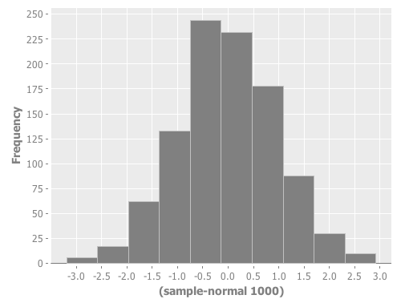
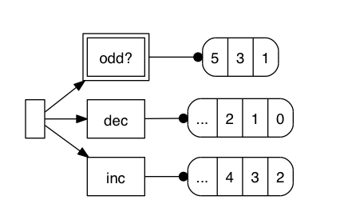

## Clojure reciepies of the day

### I'll have the usual

####  Give some colors to your REPL
[https://github.com/ibdknox/colorize](https://github.com/ibdknox/colorize)

<code>
[colorize "0.1.0"]
</code>

Colorize is a super simple ansi colorizing library. Try it for yourself:

@@@ ruby 54_colorize.clj @@@

####  Asynchronous http server and ... client. 
[https://github.com/shenfeng/http-kit](https://github.com/shenfeng/http-kit)

In the same time, you can turn yourself asynchrnous with http-kit. 

<code>
[me.shenfeng/http-kit "1.2.0"]
</code>

@@@ ruby 36_http_kit.clj @@@

The server will be started, and will delay answer to the client. No dependency so kind of very lightweight and wicked.
It also incorporate a kinda cool http client, again with no dependencies. Give a try.

####  Easy statistics with Incanter.

[Download](http://incanter.org/downloads/) and [Get started](https://github.com/liebke/incanter/wiki#getstarted)

The download above includes a bunch of stuff you may not need. A faster way to get started is to go the usual route with Leiningen
<code>
[incanter "1.3.0"]
</code>

Then you can play around:

@@@ ruby 38_incanter.clj @@@

The image below has been generated from the script above ! 

Whats your next diagram ? 

####  Where the doc ? It's literate. 
[https://github.com/fogus/marginalia](https://github.com/fogus/marginalia)

Marginalia is your best literate programming tool for clojure.  

Install it as a dependency in your project.clj file:

<code>
	:dev-dependencies [lein-marginalia "0.7.1"]
</code>

Then, just use it:
<code>
	lein marg
</code>

And dependending on the amount of comments you wrote in the code, you will get something similar to this:

####  Easy and beautiful graphs
[https://github.com/pallix/lacij](https://github.com/pallix/lacij)

A library that can quickly create SVG diagram with automatic layout, like this one:

Then, a graph can be drawn like this:

@@@ ruby 13_lacij.clj @@@

The advantage is that you can add and remove nodes dynamically, thus giving a dynamic view about live typologies.

####  Easy User Interface Applications with Seesaw
[https://github.com/daveray/seesaw](https://github.com/daveray/seesaw)

Make cool UIs in no time.

The best tutorial I have found so far is [here](https://gist.github.com/1441520)

And by trying the example, here is a style you can get after a few lines:

####  xpath queries
[https://github.com/kyleburton/clj-xpath](https://github.com/kyleburton/clj-xpath)

Now you been looking on how to process those xml files as fast as possible, here is a super way to do it, clj-xpath.

@@@ ruby 17_clj_xpath.clj @@@

####  html parsing with delicious jsoup
[https://github.com/mfornos/clojure-soup](https://github.com/mfornos/clojure-soup)

This is a wrapper to provide awesome parsing of html files, whether local or remote. Once you have added the library, check out the following example:

@@@ ruby 18_clojure_soup.clj @@@

####  Templating the clojure way with Enlive
[https://github.com/cgrand/enlive](https://github.com/cgrand/enlive)

HTML parser, and Templating framework at the same time, Enlive does a super job of making HTML fun. (yes you read me.)

This is an example taken from a [slick tutorial](https://github.com/swannodette/enlive-tutorial/) by David Nolen.

@@@ ruby 16_enlive.clj @@@

You declare templates in a regular html files, thus your designer can do his Dreamweaver work the way he/she usually does it. 
Then as a developper you just come and stick content at the location that has been decided. Slick uh ?

[Scrapping with Clojure and Enlive](http://bestinclassblog.tumblr.com/post/22729197447/how-clojure-got-me-banned-from-google)

####  Easy Spreadsheet with docjure
[https://github.com/ative/docjure](https://github.com/ative/docjure)

The best way to have fun with spreadsheet in clojure. Relies on the [Apache POI](http://poi.apache.org/) library but with some clojure sauce so it can actually be eaten.

This is how you write a simple spreadsheet.

@@@ ruby 21_docjure.clj @@@

For more examples, I suggest you look at the ["horrible" documentation](http://poi.apache.org/spreadsheet/how-to.html#sxssf) :)

####  Spam master with postal 
[https://github.com/drewr/postal](https://github.com/drewr/postal)

I am pretty sure you knew how to send a mail before, but look at the awesome way of doing this in Clojure.

@@@ ruby 22_postal.clj @@@

This is including attachment and Japanese encoding. yey

####  How's the DNS going ? 
[https://github.com/brweber2/clj-dns](https://github.com/brweber2/clj-dns)

> DNS Querying in Clojure. 

<code>
[com.brweber2/clj-dns "0.0.2"]
</code>

How easy it is to do lookup and reverse lookup. Need anything else ? 

@@@ ruby 29_dns.clj @@@

####  Don't touch my clostache: more templating 
[https://github.com/fhd/clostache](https://github.com/fhd/clostache)

<code>
[de.ubercode.clostache/clostache "1.3.0"]
</code>

Some very simple templating magic.

@@@ ruby 33_clostache.clj @@@

####  When you need some CSV magic
[https://github.com/davidsantiago/clojure-csv](https://github.com/davidsantiago/clojure-csv)

<code>
[clojure-csv/clojure-csv "2.0.0-alpha1"]
</code>

Now that we have mustache, I actually have added a longer example showing how to convert a csv files containing people addresses, to a vcard vcf file format.
Took a few minutes to write the code, not a single exception, and all using multiple cores to convert the map.

Sweeet.

@@@ ruby 32_csv.clj @@@

This is greatly inspired by a web based address book application available on [github](https://github.com/KushalP/addressbook/blob/master/src/addressbook/format.clj).

####  When google reader is not enough, some RSS magic.
[https://github.com/yogthos/clj-rss](https://github.com/yogthos/clj-rss)

<code>
[clj-rss "0.1.2"]
</code>

@@@ ruby 35_rss.clj @@@

This is taken from [here](http://yogthos.net/blog/17).

####  You need to grrrowl to make great notifications
[https://github.com/franks42/clj-growlnotify](https://github.com/franks42/clj-growlnotify)

<code>
[clj-growlnotify "0.1.1"]
</code>

@@@ ruby 34_growl.clj @@@

When you run the script above, if you have the growl notification system ([osx](http://growl.info/), [windows](http://www.growlforwindows.com/gfw/)) installed on your machine, you will get a nice message like the one below:

####  All about JSON with Cheshire.
[https://github.com/dakrone/cheshire](https://github.com/dakrone/cheshire)

Or how to do proper json fun in the Clojure style. Cheshire is there for good.

<code>
[cheshire "4.0.2"]
</code>

@@@ ruby 37_json.clj @@@

Note how you can get keywords back, or do some extra mapping on dates. No more JSON problems.♫

####  Compute digest for just about everything.
[https://github.com/tebeka/clj-digest](https://github.com/tebeka/clj-digest)

This is your everyday tool to compute digest on just about everything. It comes from clojars:
<code>
[digest "1.3.0"]
</code>

And voila. A few lines to compute digest from files, strings bytes etc ...

@@ ruby 39_digest.clj @@@

####  Terminal and user interfaction, with lanterna.
[https://github.com/sjl/clojure-lanterna/](https://github.com/sjl/clojure-lanterna/)

Fun with the terminal. 
<code>
[clojure-lanterna "0.9.2"]
</code>

This simple script:
@@@ ruby 40_lanterna.clj @@@

will spawn a terminal, and display some text:

It is also easy to wait for keys, and other terminal things fun.
Have a look at the extensive [documentation](http://sjl.bitbucket.org/clojure-lanterna/screens/) to get you excited.

####  What time is it ? It's clj time
[https://github.com/seancorfield/clj-time](https://github.com/seancorfield/clj-time)

Wrapper around jodatime to do dates times and everything time related the clojure way.

Add this to your project.clj
<code>
[clj-time "0.4.3"]
</code>

@@@ ruby 41_time.clj @@@

Will make your life with timezones definitely better :)

####  SSH shortcuts
[https://github.com/hugoduncan/clj-ssh](https://github.com/hugoduncan/clj-ssh)

<code>
[clj-ssh "0.4.0"]
</code>

A wrapper to automate ssh commands, using the default ssh agent on the local machine.
There is probably more to read if you are on windows. 

@@@ ruby 45_ssh.clj @@@

####  Master of them all HTTP client
[https://github.com/dakrone/clj-http](https://github.com/dakrone/clj-http)

clj-http is your usual wrapper around the [apache http client](http://hc.apache.org/). That http client has been around for quite a few years, and propose a very robust api. Now with clojure, we can even have it short.

<code>
[clj-http "0.1.3"]
</code>

The following example show how to send a post request to ask for some image processing to be done in the cloud through the [blitline API](http://www.blitline.com/docs/quickstart).

@@@ ruby 59_blitline.clj @@@

####  How's your serial port doing  ?
[https://github.com/samaaron/serial-port/blob/master/src/serial_port.clj](https://github.com/samaaron/serial-port/blob/master/src/serial_port.clj)

<code>
[serial-port "1.1.0"]	
</code>

Very useful to access the USB port of your machine when the JVM actually has some limitation. This is going deep down the roots of the computer and may not work. Some other libraries like calx and penumbra may have this embedded already. So this is mostly for reference. Now is the time to start your own driver :)

@@@ ruby 51_serial.clj @@@

####  No memory, but I know how to stream that XML !
[https://github.com/marktriggs/xml-picker-seq](https://github.com/marktriggs/xml-picker-seq)

What to do when you have to deal with pretty big xml files. This library supports up to 1Gb heavy files, more than you should need on average.

<code>
[xml-picker-seq "0.0.2"]	
</code>

@@@ ruby 52_xml_seq.clj @@@

####  Natual language processing in Clojure
[https://github.com/dakrone/clojure-opennlp](https://github.com/dakrone/clojure-opennlp)
Natural Language Processing in Clojure.

This is has to be one of the most technical subject available to be used just as is in this book.  OpenNLP allows you to parse text into something meaninful so you can reuse it in your application.

<code>
[clojure-opennlp "0.1.10"]
</code>

I have added here the most simplest example on how to parse text. 

@@@ ruby 61_opennlp.clj @@@

Note that this is only the most basic use of the OpenNLP library.
You can see a vast list of direct examples in the [README](https://github.com/dakrone/clojure-opennlp/blob/master/README.markdown) and a full section has been written on how to [train](https://github.com/dakrone/clojure-opennlp/blob/master/TRAINING.markdown) new models to use in your application.

####  Full Clojure stream ahead ! Use conduit
[http://www.intensivesystems.net/tutorials/stream_proc.html](http://www.intensivesystems.net/tutorials/stream_proc.html)
Stream processing in Clojure. 

Latest version in the stream processing for Clojure. This will get values in, apply a transformation, and then get the values out as they are coming. 

<code>
[net.intensivesystems/conduit "0.9.0"]
</code>

@@@ ruby 63_conduit.clj @@@

####  Event workflow and stream processing in Clojure

[https://github.com/ztellman/lamina](https://github.com/ztellman/lamina)
Event workflow for clojure, stream processing in Clojure.

Lamina defines the very awesome concept of queues to receive events or values and then process them as they are coming. Lamina makes it very easily to play and visualize what is happening troughout the different queues waiting for values.

Import it in your project with:
<code>
[lamina "0.5.0-alpha2"]
</code>

You would need [Graphiz](http://www.graphviz.org/Download..php) installed on your machine to display how the channels are handling data.

@@@ ruby 62_lamina.clj @@@

@@@ ruby 62_lamina2.clj @@@

#### Everyday cryptography with Alice, but where is bob ? 
[Cryptography for Clojure](https://github.com/pjstadig/alice)

#### Unit of measures calculator in Clojure

[Unit of Measure Calculator](https://github.com/martintrojer/frinj) and [samples](https://github.com/martintrojer/frinj/blob/master/src/frinj/examples.clj)

#### When you are in need of querying Json
[JsonPath](https://github.com/gga/json-path)

####  Clojure on your nerves ? Use Netz for your neural network things
[Netz, Clojure Neural Network Library](https://github.com/nickewing/netz)

#### SSH Tunnels
[SSH Tunnel](https://github.com/trampoline/clj-ssh-tunnel)

#### infer, inference and machine learning in Clojure
[infer, inference and machine learning in Clojure](https://github.com/ssurgnier/infer)

#### Shake, or every shell program is now a clojure function
[Shake](http://sunng.info/blog/2012/09/shake-every-program-can-be-a-clojure-function/)

#### Timely, or your super easy scheduling in Clojure
[Scheduler](https://github.com/Factual/timely)

#### Generate, string clean HTML in a clojure way without hiccups
[hiccup](https://github.com/weavejester/hiccup)

#### Ahead of time scheduler at
[Ahead of time scheduler](https://github.com/overtone/at-at)

#### On parsing ANTLR grammars with Clojure
[AntLR via Clojure](http://briancarper.net/blog/554/antlr-via-clojure) and [lein-antlr](http://github.com/alexhall/lein-antlr)

#### How to glob files
[glob files](https://github.com/neatonk/clj-glob)

#### Asynchronous HTTP Client
[Async HTTP Client](http://neotyk.github.com/http.async.client/)

#### Google protobuffer for Clojure
[https://github.com/flatland/clojure-protobuf](https://github.com/flatland/clojure-protobuf)

#### Idiomatic pattern matching in Clojure
[Matchure](https://github.com/dcolthorp/matchure)

#### Clojure interface to superb search engine Lucene
[Clucy](https://github.com/weavejester/clucy) 

#### Interface with your own Solr based search engine
[Solr Querying](https://github.com/mattdeboard/Icarus) and [lsa4solr](https://github.com/algoriffic/lsa4solr)
[https://github.com/mikejs/clojure-solr](https://github.com/mikejs/clojure-solr)

#### When in need of pdf magic
[PDF as a service](https://github.com/yogthos/instant-pdf)
[iText wrapper](https://github.com/yogthos/clj-pdf)

#### Clojure wrapper for complex event processing, based on Esper
[Event Processing](https://github.com/pingles/clj-esper)

#### A few words on Monads in Clojure
[Monad](https://github.com/clojure/algo.monads)

#### A few words on the new reducers sauce
[Reducers](http://clojure.com/blog/2012/05/08/reducers-a-library-and-model-for-collection-processing.html)

#### A few logical words
[core logic](https://github.com/clojure/core.logic/wiki/Examples)

#### A few words about haskell
[Kessel](https://github.com/apgwoz/kessel) is a more clojure-fied version of clarsec, which itself is a port of Haskell's Parsec to Clojure, but should port to a newer version of clojure.
[clarsec](https://github.com/jasonjckn/clarsec), 

#### When you need an oauth, you have friends
[friend oauth](https://github.com/ddellacosta/friend-oauth2)
