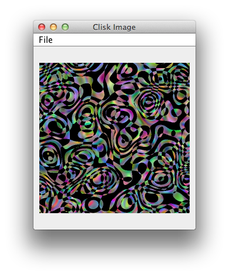
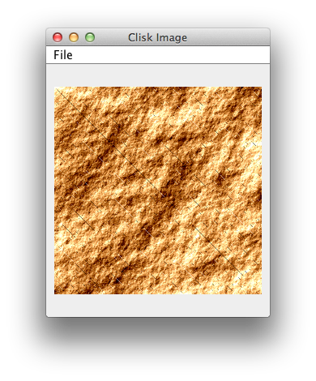

### It's only logical

#### Fractals

Clisk is a Clojure based DSL/library for procedural image generation.
    You can use it for:

    Creating 2D material textures for games
    Building fractal images / artwork
    Generating 3D or 4D textures for raytracing (e.g. in Enlight: https://github.com/mikera/enlight)
    Creating patterns (e.g. randomly generated maps)

This is how to find it in Clojars:

    [net.mikera/clisk "0.7.0"]

I arrived to clisk through this [blog entry](http://clojurefun.wordpress.com/2012/08/30/mandelbrot-fractals/) and got totally in love with its ease of use for creating mathematical graphics. 

Example 1 shows how to start with clisk and some voronoi map mathematical function. 

@@@ ruby chapter03/src/clisk1.clj @@@

Then how to play along with checker patterns:

@@@ ruby chapter03/src/clisk2.clj @@@

Next example on how to play with plasma-like gradient:

@@@ ruby chapter03/src/clisk3.clj @@@

And last one, with the famous mandelbrot fractal.

@@@ ruby chapter03/src/clisk4.clj @@@

#### your dose of genetic algorithm in Clojure

##### Gajure
Gajure is not really a full on project, but more hints at how you can use and have fun with genetic programming.

Suppose we have to find out a somewhat secret value, with the only source of information being a method that tells us some information about that value.
This is where genetic algorithm comes handy. We generate random sets of values, and try to find out their fitness through the provided method.
Then each round, we keep some results, and remove other ones. We also need to be sure to have a big enough pool at each generation to prevent locking ourselves down with the wrong information.

This is what the gajure example is about. Let's go along this together:

@@@ ruby chapter03/src/gajure.clj @@@

Now, once you have run the example, you should try to change the input value, and the different settings for running the genetic algorithm.
Now this tool can be very useful for:
- computer gaming ;)
- network routing
- time tables and scheduling

##### Clojush
