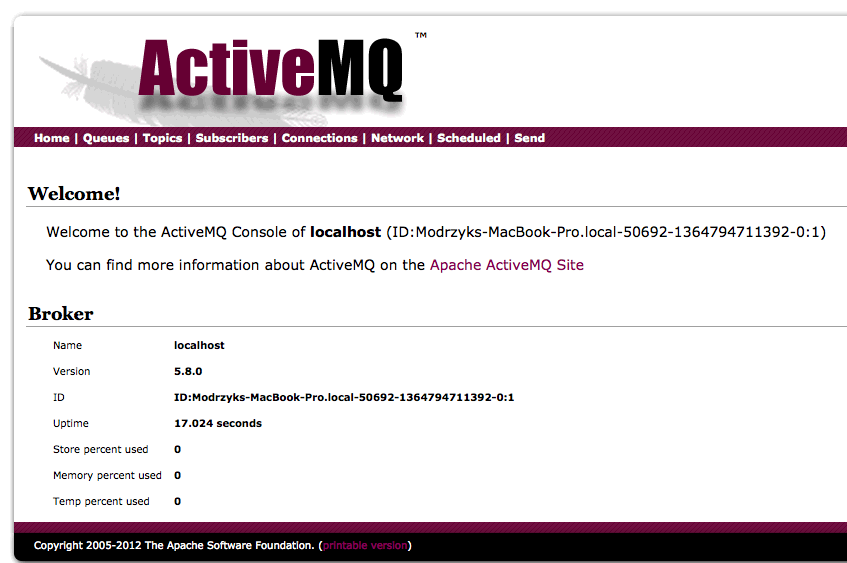
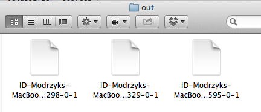

## Messaging

Because your application will probably not be standalone, but will be talking to a horde of different systems, we have created the Messaging chapter. I had the experience, though, to connect a clojure system to an impossible to configure banking system. The messages were so big I was only hoping the messaging queues will not blow up. What Clojure brought to me is the incredible flexibility to just say, "Yes, I can handle that message." or "Yes I can handle that timing and react in realtime" and have a pretty good certitude that if a problem was coming in the integration, it was not coming from the people at the dining table that we are. 

Here, we would like to show you a bit of this, and give you some insurance about easiness, readability and performances. 

This section will go in a bit details how to connect to different middleware like RabbitMQ, MemCache, Redis, JMS... and a few others, so you can get started quickly to core level of your work.

### Clamq, or your clojure toolkit for JMS, AMQP and RabbitMQ

Here comes the most generic [JMS, AMQP/RabbitMQ](https://github.com/sbtourist/clamq) middle ware in the Clojure land. Clamq basically connects you to the most famous queuing system of these days, with the same client code, so you won't even face problems if you need to switch from one to the other, or actually if you have the chance to change from one to the other.

For a short example, we will use [ActiveMQ](http://activemq.apache.org/download.html), not only for efficiency but because it is probably the fatest way to get started.
Let's start by downloading the package from:
	
	http://activemq.apache.org/download.html

Or your favorite package manager.
Once expanded, we can go to the *bin* folder where all the binaries are installed. We will then start the system with the simple command:

	./activemq start

Once the system is started, you can go to your browser, and access the admin [web console](http://activemq.apache.org/web-console.html):

	http://localhost:8161/admin/

Where the login is:

	admin / admin

If all goes well, you should see the following screen:

Now we are all ready for some quick examples. To start working with clamq, we will require two dependencies:

	[clamq/clamq-jms "0.4"]
	[clamq/clamq-activemq "0.4"]

One for the core of clamq, the other one for the extra activemq extension. We could as well work with a simple JMS provider, but I like ActiveMQ all the same.

Our code presents how to write a simple producer/consumer test using a remote messaging queue, that will be created in ActiveMQ:

	@@@ ruby chapter05/src/clamq.clj @@@

If we look, at the admin web console, we can see the queue is empty before the code is run:

and contains the message we sent using our small snippet:

Our next example will be showing how to use a Topic. Remember a topic is the way to broadcast the same message to multiple subscribers. 

	@@@ ruby chapter05/src/clamq_topic.clj @@@

And, we pretty much notice that the code was very similar that the one for queues with the extra addition of:

	{:pubSub true}

For more of the ActiveMQ fun, you can have a look at the [ActiveMQ test suite](https://github.com/sbtourist/clamq/blob/master/clamq-activemq/test/clamq/test/activemq_test.clj) and its related [jms suite](https://github.com/sbtourist/clamq/blob/master/clamq-jms/src/clamq/test/base_jms_test.clj).

Suiiiiite.

### I have my horse, ride your Camel, easy messaging bus with everyone

I took exampes from [Apache Camel from Clojure](https://github.com/denlab/apache-camel-clojure) and 
[Camel Routes with Clojure](https://github.com/hellonico/clj-camel) to create this really short introduction to using Apache Camel, which acts as a *versatile open-source integration framework* or how to pretty much connects any kind of protocol to any other one in a snap. Snaps.

#### Camel on files 

In the first example we are going to connect a file to .. a file. Not very useful you might say, but wait, we will get the basics and ride on a nice wave of communication.

For this tutorial, we will use a somewhat custom dependency of clj-camel (see above) that we have thrown in the pot of clojars. Let's grab it with:

	[clj-camel "1.0.1"]

Once our REPL is sorted out, let's go through the file to file connection:

	@@@ ruby chapter05/src/camel_file.clj @@@

So we start by configuring routes the Camel way to point from an endpoint :from to and endpoint :to. 

Then we start the Camel context which is now able to listen to all the endpoints that were defined.

Programmatically we can check that when we send a message to the queue :from, we will get a new file created in the folder we have defined, here *in*.

The next obvious step is to check whether we can create a file in the folder *in* and see if it appears in folder *out*. On *nix machines we can use:

	echo "hello" in/test.txt

In Windows all the same we can create a simple text file, with some "hello" the world of wine content. And there we go:

Files are created as we put some content in the in folder.

We have commented out the line:

	   ; [:to "log:com.mycompany.order?level=INFO"]

But if you put it back, you will see a logging message in the REPL showing that the message was properly processed. 

#### Camel on queues 

Our next example will extend our first example with some queues to connect to ActiveMQ since we put some time to set it up earlier on. The ActiveMQ endpoint is not part of the core camel components so we added that to our set of dependencies already with clj-camel.

	@@@ ruby chapter05/src/camel_queue.clj @@@

Only one added line to register the ActiveMQ component. But then adding a file to our :from folder will send directly a message to active mq with the content of the message.

But this is not all. Camel has an impressive set of [default components](http://camel.apache.org/components.html) that you can use just by accessing them through their URL scheme. All this at your Clojure hands. 

### Sometimes you need some Quartz, to schedule your Clojure
[Clojure with Quartz](http://clojurequartz.info/articles/getting_started.html)

### Redis in your clojure
[Redis](https://github.com/wallrat/labs-redis-clojure)

### Distribute your application state with zookeeper and avout
[Avout](https://github.com/AlexBaranosky/avout)

### Every one talks about Hadoop, so let's talk to it with Clojure
[Hadoop](HBase: http://twitch.nervestaple.com/2012/01/12/clojure-hbase/)

### Hadoop queries from Clojure with Cascalog
[https://github.com/nathanmarz/cascalog/wiki](https://github.com/nathanmarz/cascalog/wiki)
Hadoop Query from Clojure

### Basic Apple Push Notifications
[Apple Push Notifications](https://github.com/HEROLABS/herolabs-apns)

### Where would you be without a spyglass (and a proper memcache client)
[Memcache](http://clojurememcached.info/articles/getting_started.html)

### Calling SIP, calling clojure
[SIP](https://github.com/Ruiyun/cljain)

### Apache Cassandra, at your clojure tips
[Cassaforte](https://github.com/clojurewerkz/cassaforte)

### The best Actor model concurrency in the scala world coming to Clojure
[Akka wrapper for Clojure](https://github.com/gaverhae/okku)

### Simple Apache Thrift, powering Facebook, in Clojure
[Thrift from Clojure](http://thecomputersarewinning.com/post/simple-thrift-in-clojure/)

### Storm is a distributed realtime computation system, accessible from Clojure
[https://github.com/nathanmarz/storm/wiki/Clojure-DSL](https://github.com/nathanmarz/storm/wiki/Clojure-DSL)

