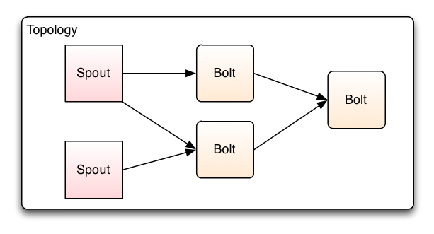

### Storm is a distributed realtime computation system, accessible from Clojure

Storm claims to be the hadoop of real time processing. As we have seen in the previous section, hadoop takes some jobs in and then processed them, but we never really now when the job would be finished. 
Storm wants to overcome this limit and enhances possibilities. 

A Storm cluster is superficially similar to a Hadoop cluster. Whereas on Hadoop you run "MapReduce jobs", on Storm you run "topologies". "Jobs" and "topologies" themselves are very different -- one key difference is that a MapReduce job eventually finishes, whereas a topology processes messages forever (or until you kill it).

#### Fundamentals about storm

The core abstraction in Storm is the "stream". A stream is an unbounded sequence of tuples. Storm provides the primitives for transforming a stream into a new stream in a distributed and reliable way. For example, you may transform a stream of tweets into a stream of trending topics.

The basic primitives Storm provides for doing stream transformations are "spouts" and "bolts". Spouts and bolts have interfaces that you implement to run your application-specific logic.

A spout is a source of streams. For example, a spout may read tuples off of a Kestrel queue and emit them as a stream. Or a spout may connect to the Twitter API and emit a stream of tweets.

A bolt consumes any number of input streams, does some processing, and possibly emits new streams. Complex stream transformations, like computing a stream of trending topics from a stream of tweets, require multiple steps and thus multiple bolts. Bolts can do anything from run functions, filter tuples, do streaming aggregations, do streaming joins, talk to databases, and more.

Networks of spouts and bolts are packaged into a *topology* which is the top-level abstraction that you submit to Storm clusters for execution. A topology is a graph of stream transformations where each node is a spout or bolt. Edges in the graph indicate which bolts are subscribing to which streams. When a spout or bolt emits a tuple to a stream, it sends the tuple to every bolt that subscribed to that stream.

We summarize all this in a simple diagram:

#### Storm starter

[Nathan](https://github.com/nathanmarz) has produced some clean and up to the point documentation, so we will follow on his  introduction to storm using [Storm starter](https://github.com/nathanmarz/storm-starter)

The example in storm started makes fulluse of the [Storm DSL for Clojure](https://github.com/nathanmarz/storm/wiki/Clojure-DSL), so please refer to it if something is not obvious.

We remember from the Storm introduction that we need to define topologies.

    To define a topology, we use the topology function. topology takes in two arguments: a map of "spout specs" and a map of "bolt specs". Each spout and bolt spec wires the code for the component into the topology by specifying things like inputs and parallelism.

Let's go through a simple example that will use all the needed functions to get running quickly.

@@@ ruby chapter05_storm/src/clj/storm/starter/clj/word_count_0.clj @@@

From the bottom up:

* run-local will start a local storm cluster. We will submit the next to come topology to this newly created cluster. When submitting the topology we can define parameters such as the number of workers, and whether we want to see the output of the topology or not. This is done with: {TOPOLOGY-WORKERS 3 TOPOLOGY-DEBUG true}
* mk-topology: as we remember a topology is made of two maps, one of spout, or input streams, and another maps for bolts, the nodes processing data. We make sure all the ids in the two maps are not overlapping and are unique.
* our origin spout, remember input stream, will randomly output sentences from the set of 4 hardcoded sentences.
* the bolt processing the data is connected to the spout we have just created using: {"1" :shuffle}, and will be output data itself.

We can run the cluster and the topology locally with the usual Leiningen command:

    lein run -m storm.starter.clj.word-count-0

A sample of the logs will show something like:

    10033 [Thread-23] INFO  backtype.storm.daemon.task  - Emitting: 1 default ["the man petted the dog"]
    10033 [Thread-22] INFO  backtype.storm.daemon.executor  - Processing received message source: 1:1, stream: default, id: {}, [the man petted the dog]
    10034 [Thread-22] INFO  backtype.storm.daemon.task  - Emitting: 2 default ["the"]
    10034 [Thread-22] INFO  backtype.storm.daemon.task  - Emitting: 2 default ["man"]
    10034 [Thread-22] INFO  backtype.storm.daemon.task  - Emitting: 2 default ["petted"]
    10034 [Thread-22] INFO  backtype.storm.daemon.task  - Emitting: 2 default ["the"]
    10034 [Thread-22] INFO  backtype.storm.daemon.task  - Emitting: 2 default ["dog"]

When the spout with id 1 emits the string "the man petted the dog", the bolt with id 2 will perform one emit with each of the word that was generated from the sentence. 

#### Closings and Openings

Deploying storm on Amazon Web Service is been going in details in the [storm-deploy wiki](https://github.com/nathanmarz/storm-deploy/wiki). We will show some Amazon deployment in the next section, so we keep that for further reference.

Storm easily integrates with any queueing system and any database system. Storm's spout abstraction makes it easy to integrate a new queuing system. 
Likewise, integrating Storm with database systems is easy. Simply open a connection to your database and read/write like you normally would. Storm will handle the parallelization, partitioning, and retrying on failures when necessary.

For further reading and openings, [Trident](https://github.com/nathanmarz/storm/wiki/Trident-tutorial) is for advanced usage, and is a high-level abstraction for doing realtime computing on top of Storm. 

[Storm](http://storm-project.net/) is used at Twitter, Taobao, Groupong to name a few, so as far as real time analytics goes, you should be able to scale out as fast and as easily as you need.

