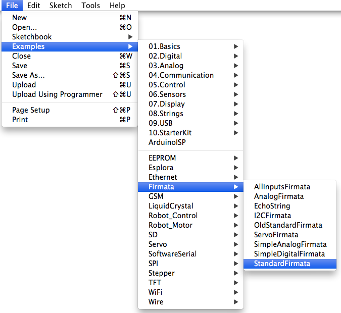
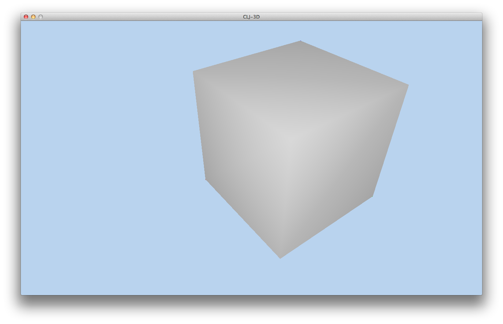
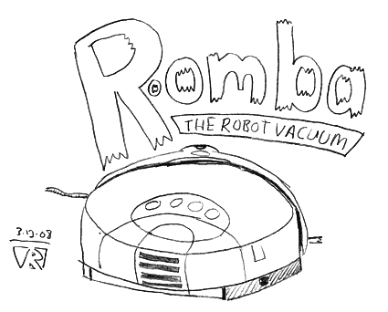

## Arduino

Now originally I was really dying to do things the way [Nurullah Akkaya](https://github.com/nakkaya) is doing. He has such a perfect sense for putting projects out there that will trigger your interest and make you passionate and curious about new things.

I have been passionated about [Arduino](http://ja.wikipedia.org/wiki/Arduino) for quite a while now and have a few of those babies at home connected to each others.

But there has always been one thing that annoying me a little bit while playing with the hardware was the time needed to compile code and send it to the Arduino board.

Now this is yet again one of the great theme in this book, we can now do live programming of the board itself using Clojure.

If you think this section is not for you, because you're not into hardware programming (yet!), do [buy a board on Amazon](http://www.amazon.co.jp/dp/B0044X2E5S) by the end of today in your house and join the live programming session.

Let's see how.

### Cloduino: Clojure on Arduino

[Clodiuno](https://github.com/nakkaya/clodiuno) is going to be our library of choice for playing with the Arduino board, but first ... let's check we have everything.

#### Gathering the pieces

As we already talked about in the introduction of this chapter, you will need a board. While there are a lot of specialized shop, especially the great people at [cooking hacks](http://www.cooking-hacks.com/), your best bet is probably to get it from Amazon.

They also provide [starter kits](http://www.amazon.co.jp/dp/B0025Y6C5G) if you do not have yours yet.

Once the kit is in your hand, [download the Arduino](http://arduino.cc/en/main/software) software, choosing the proper package for your platform.

Now, connect the board to your computer via USB.

Once the board is connected, we will quickly check pieces are ready. Let's load the blink example to the board:

Then upload the sketch to the Arduino board.

Finally we should see the LED 13 blink on and off every 1 second.

That was just enough to check all is in place. There are plenty of tutorials around for Arduino. Do some homework if you have the time to make things blinking all around and prepare for Christmas.

Once your house is about to be out of electricity, pour some wine in that empty non electrical glass and let's move on.

#### Upload Firmata

At the base of Cloduino, is the [Firmata protocol](http://arduino.cc/en/reference/firmata), that allows for communication with software on the host computer.

We upload it to our Arduino board the same we have done for the blink example.

    File -> Examples -> Firmata -> StandartFirmata

The upload goes the same way as well.

Once you have successfully uploaded the Firmata protocol, we can play.

#### Endless blinking

We will create a blank project with the usual new module for Leiningen.

    lein new cloduino_sample

And add the dependency to Cloduino:

    [clodiuno "0.0.4-SNAPSHOT"]

The blinking code is included in the example:

@@@ ruby chapter09/cloduino/src/cloduino/sample.clj @@@

What have we here that is not specific to Clojure ?

We define a board using cloduino's *arduino* method.

    board (arduino :firmata "/dev/tty.usbmodemfa131")

Note the port to the arduino board is actually showing in the Arduino software.

The second thing that is new, is setting the mode of the PIN we are going to use. This is done using the pin-mode function on the board with:

    (pin-mode board 13 OUTPUT)

This means we will _write to_ PIN 13.

Third and last thing is, you guessed it, the actual write method, that closely match the original C method:

    (digital-write board 13 HIGH)

That is about all there is to know about the Clojure code so .. let's start a REPL ! Loading the cloduino/sample.clj then we can call the SOS method :

     (cloduino.sample/sos)

This will get your board's LED blinking for a bit of time, until you realizing no one is coming to help because really, this just a blinking LED on an Arduino board.

But fun no ?

#### Are we live yet ?

This is all great, but so much for live programming you might say. We hear you.

Taking on the core pieces of the example above, we, actually you !, can try typing the lines of the following file one by one:

@@@ ruby chapter09/cloduino/src/cloduino/live.clj @@@

You could even reproduce the SOS message manually typing the code one by one if you are fast enough !

Note, that using the breadboard isn't much more complicated. So if we plug pin 12 to the breadboard and define the mode as we have done before:

    (pin-mode board 12 OUTPUT)

Then the red light will come:

#### More blinking ideas

There are so many more great [samples](http://nakkaya.com/clodiuno.html) on Nakkaya's blog, it will keep you going excited for quite a bit of time. Make sure to send us back some comments on what you implemented.

Personally, the best hack I have seen with this, is to connect a [REPL to your Roomba](http://gigasquidsoftware.com/wordpress/?p=450) robot.

Of course, connecting quil or overtone is totally allowed and part of the adventure.

Robot are going mad.

### Going native, C code interfacing with Clojure

We already have seen a lot of native code with OpenCV and OpenGL in the last chapter.
Now comes [Clojure Native](https://github.com/bagucode/clj-native), a rough but working implementation to interface Clojure code and C code.

The C library we are going to interface with is quite simple:

@@@ ruby clj-native/src/examples/simple.c @@@

Basically we define the simplest function in C:

    const char* returnsConstantString()

And another one with parameters and a return value:

    int add(int x, int y)

In the examples folder, we can compile it with gcc:

@@@ ruby clj-native/src/examples/build_simple @@@

And it will generate a platform dependent library.

We do remember from the previous chapter that we add a quick setting in project.clj for JNA, the Java Native Access to work:

    :jvm-opts ["-Djna.library.path=src/examples"]

The Clojure side of things is not very complicated either. We need to enumerate the functions we will use inside a *defclib* macro.

The remaining part of it, is simply load the library we have just compiled with *loadlib*, and calling the functions directly as if they were defined in Clojure.

This now reads in the code below:

@@@ ruby clj-native/src/examples/simple.clj @@@

If we run it with:

    lein run -m examples.simple

The output will natively be:

    This string should be safe to read as const char*
    3

Nice and simple.

The clj-native folder contains a full example defining struts, unions, and callbacks on top of the functions we have just seen.

Have fun reading through it !

## Gaming

In this section, we will briefly go into the world of gaming. This is to get you going and see what happens in the Clojure world, but this section alone would deserve a book on its own as well. (hint hint).

We will see how to have fun with 3D models and textures, as well as getting through a potential hello world for a real game, based on the jmonkeyengine.

### Monkeys like gaming, so does Clojure: Gaming

A long time I ago, just around 10, I picked up a book on [Game theory](http://en.wikipedia.org/wiki/Game_theory). I was a lot into Role Playing games at the time, and thought that this was going to help me design more entertaining games for those role playing sessions. Little did I know I was completely off. It did take me some time to read the different explanations and was quite soon on the path to be very interested into the process of decision making.

So what do we have in the pure Clojure land for games ?

#### clj3D

Clj3D is massively based on the excellent jMonkeyEngine and it tooks the best of it. PLaSM is a "design language" for geometric and solid parametric design, developed by the CAD Group at the Universities "La Sapienza" and "Roma Tre".

Clj3d was my first 3d adventure in the Clojure land. It's been left out a bit now but if you have the energy, let's update it and bring it up to speed !

The original repository is located at: https://github.com/adinapoli/clj3D, but it was in need of some spring cleanup so we ported it to:

    https://github.com/hellonico/clj3D

To include this in your project and start the fun, include the following dependency:

    [hellonico/clj3d "0.0.6"]

And for the moment, until further notice, we should stay onto a previous version of Clojure:

    [org.clojure/clojure "1.2.0"]

We start the REPL and ...

##### Live 3D

We start by importing the namespaces:

    (use '(clj3D math fl fenvs viewer) :reload)

Display a 1x1x1 cube

    (view (cube 1))

Creates a green torus

    (def green-torus (color :green (torus 0.5 1.0)))
    (view green-torus)

Creates a red torus rotated by PI/2 on X axes and translated on X by -1.0

    (def red-torus
        (struct2
            (t 1 -1.0)
            (r 1 (/ PI 2.0))
            (color :red)
            (torus 0.5 1.0)))

     (view red-torus)

And assemble the two torus together:

     (view (struct2 green-torus red-torus))

We can also load textures and models quite easily. Models, mostly wavefront obj files are loaded from the models folder. We have included

From the repl, this translates into:

    (view (load-obj "car.obj"))

And this shows

Et voila.

#### Orbit

In 2013, an new project named [orbit](https://github.com/odyssomay/orbit) has also started a great Clojure wrapper around the [jmonkey engine](http://jmonkeyengine.com/).

Since all the required libraries are properly packaged together, we can start doing a nice [hello jmonkey from Clojure](
http://www.thejach.com/view/2012/05/getting_started_with_jmonkeyengine and_clojure).

The code to get started is in:

@@@ ruby chapter09/orbit/test/orbit/monkey.clj @@@

Let's go through it slowly.

* We start by defining an asset manager, responsible for providing an interface for managing the data assets of a jME3 application.

* We then go on and define the application settings, through the use of the Java class, *AppSettings*

* Moving on, we create a cube, using the *Box* method, making available as a *Geometry* object. We set it to a nice *Blue* color. We then load a texture to loaded through the Assets Manager that we defined before, and finally set the texture to the geometry.

The interesting part of the code is in:

    (let [b (Box. Vector3f/ZERO 1 1 1)
          geom (Geometry. "Box" b)
          mat (Material. assetManager
                         "Common/MatDefs/Misc/Unshaded.j3md")]
      (.setColor mat "Color" ColorRGBA/Blue)
      (.setMaterial geom mat)

Remaining of the *monkey.clj* file is mostly starting the application that we have defined by proxy-ing the java object *SimpleApplication*.

When running we luckily get:

Nice, we now have the power of the jmonkey engine to our clojure hands !

To continue from there, we recommend looking at the following [blog](http://aurellem.org/), and the especially the following entries:

* [Creating a virtual world](http://aurellem.org/cortex/html/world.html)
* [jMonkeyEngine from Clojure](http://aurellem.org/cortex/html/games.html)
* The series on Sensors and effectors. ([Building a Body](http://aurellem.org/cortex/html/body.html) ...)
* [Gabor Filters](http://aurellem.org/cortex/html/gabor.html)*

### Where's the next game ?

This section ends only to let you begin. We only touched through some fun themes, Arduino, Games preparing your imagination to just go wild and create some nice interaction from the real world, to the world of games, whether you are using sensors, touch, or again, still trying to get your [Roomba](http://napkinfactory.net/blog/?cat=8) out of the way.

