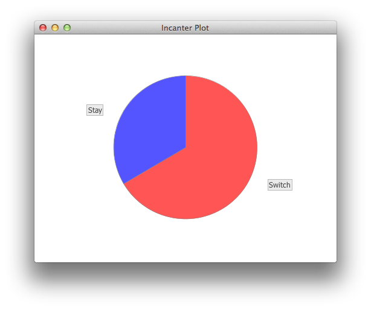

## ロジカルに行こう

###### アミューズ・グール（Amuse gueule）: 直訳すると、口の楽しみ。居酒屋のお通しみたいな感じ。

### フラクタル

Clisk はClojureベースの手続き型イメージ生成ライブラリです。
    以下の用途に使用出来ます:

    ゲーム用に2D素材の質感生成
    フラクタルイメージ/アートワークの作成
    レイトレーシングの3D/4D質感生成 (e.g. in Enlight: https://github.com/mikera/enlight)
    パターン作成 (e.g. マップのランダム生成)

Clojarsでの設定:

    [net.mikera/clisk "0.7.0"]

cliskを見つけたのは [blog entry](http://clojurefun.wordpress.com/2012/08/30/mandelbrot-fractals/) で、簡単に数学的なグラフィックを作れるのですぐに気に入りました。

サンプル 1は最初の例としてボロノイ図を描いています。

@@@ ruby chapter03/src/clisk1.clj @@@

続いて、チェッカーパターン:

@@@ ruby chapter03/src/clisk2.clj @@@

プラズマ的なグラデーション:

@@@ ruby chapter03/src/clisk3.clj @@@

そして、有名なマンデルブロ フラクタル

@@@ ruby chapter03/src/clisk4.clj @@@

#### 遺伝的アルゴリズム

##### Gajure

Gajure はフルスペックのプロジェクトではありませんが、遺伝的プログラミングに興味があるのであれば大いに参考になるところがあると思います。

未知の値を見つけなければいけないとき、手がかりがその値についての情報を得るためのメソッドのみだとしたら。 遺伝的プログラミングは、そんなニーズに応えるために生まれてきました。
まず、ランダムな値のセットを生成し、それぞれのセットがメソッドにどれだけフィットするかを検証します。 そして、検証の結果からフィットしないものを削除していきます。 また、精度の高い結果を得るためには、膨大な数のセットを検証する必要があります。

ということで、gajureのサンプルです:

@@@ ruby chapter03/src/gajure.clj @@@

一回サンプルを実行したら、入力する値と設定を変えてみましょう。
このプログラムは、例えば次の用途に使えると思います:
- ゲーム ;)
- ネットワークのルーティング
- 時刻表とスケジューリング

#### Incanterで見るモンティ・ホール問題

[Monty Hall with Incanter](http://data-sorcery.org/category/monte-carlo-simulation/)

モンティ・ホール問題とは:

    あなたはバラエティショーに出演しています。
    目の前に3つのドアがあり、1つのドアには車が入っており、他の2つのドアには山羊が入っています。 あなたがドアのうち1つを選択し、もし車が入っていれば当たりですが、山羊が出てきた場合にはハズレです。
    さて、あなたがドアを1つ選び(1とする)、次に司会者が残りの2つのドアのうち、山羊がいるドア(3とする)を開けて山羊を見せます。 そして司会者があなたに「ドア2に変更しますか？」と聞きます。 あなたにドアを変更するメリットはあるでしょうか？

この問題に対する解答も色々あって、面白いのは [YouTube](http://www.youtube.com/watch?v=mhlc7peGlGg)ですが、我々はお気に入りのIncanterライブラリを使ってClojureバージョンを作ってみましょう。

@@@ ruby chapter03/src/monty_hall.clj @@@

結果のイメージはこちら:

#### 論理プログラミング： Prologはどこへいった？

論理プログラミングは命令型、オブジェクト指向、関数型と並んで４大プログラミングの一つなのだそうです。

[Core Logic](https://github.com/clojure/core.logic/wiki/Examples) はClojureゲームの中では遅れて出てきましたが、Prologライクでリレーショナルな制約論理プログラミングをClojureで提供します。

最初のサンプルはとても簡単です:

@@@ ruby chapter03/src/logic0.clj @@@

ソースを見ると、ちょっと前にやったプログラムに似ていますが、複数の選択肢からある条件に合致するものを選んでいます。

そして、論理プログラミングはゲームAIにパーフェクトにマッチします。 次のサンプルでは、箱の中の目的地を見つけて外に出るまでのパスを探しています。 これは面白いですよ:

@@@ ruby chapter03/src/logic1.clj @@@

#### ルールエンジンが熱い

ウィキペディアによると、Reteアルゴリズムはプロダクションシステム実装のための効率的なパターンマッチングアルゴリズムなのだそうです。

論理プログラミングついでに、ここではClojureで書かれたルールエンジンである [mimir](https://github.com/hraberg/mimir) を紹介しましょう。

mimirを使うとcore.logicより少し簡単にルールを書くことができるので、紹介しました。

@@@ ruby chapter03/src/mimir.clj @@@

    このサンプルでは、ファクト中のそれぞれの値がClojureのアトムであるトリプレットを使っています。

### NoSQL

最近、というか、ここ数年はNoSQLの話題に事欠きませんね。
私は、特にMongoDBの熱烈なサポーターで、これまで何度も色々なシーンで検討してきましたが、一番重要なのは実際にどうやってデータを保存してそれを使うかですよね。

#### Clojure Monger：Mongo クライアント

どこかにデータを保存してそれを使うとしたら、おそらく MongoDB が一番簡単かもしれません。 ご存知のとおり、MongoDBはJSON的なデータでやり取りするので、非常に直感的でClojureにフィットします。
MongoDB はMTVネットワークスやその他大量のデータ処理を必要とするような所で使われています。

Mongoサーバのインストールは、以下のサイトからダウンロードして好きな場所で解凍します:

    http://www.mongodb.org/downloads

サーバをスタートするには、下記のコマンドを実行します:

    mongod --rest --dbpath data

実は上記のコマンドパラメータは必須ではありませんが、--rest フラグを指定するとダイレクトストアとRESTインターフェイスでデータを返すので、ブラウザを使ってアクセスする場合は便利だと思います。

また、dbpathでデータがストアされる場所を指定します。

次にClojure側です。 ClojureでMongoにアクセスするには [Monger](http://clojuremongodb.info/) という小さなドライバを使います。
project.clj に入れましょう:

    [com.novemberain/monger "1.4.2"]

これで、サンプルが動くようになりました。

@@@ ruby chapter03/src/mongo.clj @@@

以下のURLでMongoデータベースの中身を見ることができます:

    http://localhost:28017/monger/documents/

これが、--rest オプションを指定した理由です。 より詳しい説明はMongoDBのWebサイトで見ることが出来ます:

    http://docs.mongodb.org/ecosystem/tools/http-interfaces/

とても簡単でしたね。

#### マジめにredisライブラリ

Redis は高速なKey-Valueストアです。 memcachedに似ていますが、データセットは永続します。 値はmemcachedの様に文字列が使えますが、さらにリスト、セットなどが使えます。
Redis はin-memoryモードで使うと驚異的なパフォーマンスを発揮します。

Mac OS Xでは、_brew_ を使ってインストールできます:

    brew install redis

または、下記のサイトからパッケージをダウンロードして使うことが出来ます:

    http://redis.io/download

サーバーをスタートしましょう:

    redis-server

または

    redis-server <path_to_configuration_file>

さて、Clojureの世界にはRedisの機能を余す所無く使えるナイスなドライバがあります [Carmine](https://github.com/ptaoussanis/carmine)

Carmineを使えるようにするには:

    [com.taoensso/carmine "1.5.0"]

早速、サーバに接続して基本的なところを試してみましょう:

@@@ ruby chapter03/src/carmine.clj @@@

次に、Redisでとても気になるpublish/subscribeをどうやって使うのか見てみましょう:

@@@ ruby chapter03/src/carmine2.clj @@@

最後に、Redisの新しい機能は永続的なメッセージングキューとして動作します。 それはどうやって使うかは以下のサンプルをご覧ください:

@@@ ruby chapter03/src/carmine3.clj @@@

ここで、もう一度 Redisの特徴を挙げておきますね :

- key/value ストア
- 信頼性の高い出版-購読型モデル(publish/subscribe)
- 永続性a persistent keystore

このレシピだけでも、色々な用途が頭に浮かびますね！

#### マメにメンテナンスされているRabbitMQ

RabbitMQ は「使えるメッセージング」を誇りとしており、非常に信頼性のある高速なメッセージング環境です。
そして、この本はフランス料理のレシピ本なので、ウサギが出てくるのも違和感がありませんね！

Mac OS Xへのインストール:

    brew install rabbitmq

その他のプラットフォームへのインストール:

    http://www.rabbitmq.com/download.html

サーバのスタート:

     rabbitmq-server

さぁ、これで準備は整いました。 [langohr](https://github.com/michaelklishin/langohr) を使って、いくつかのClojureサンプルを試してみましょう。

Langohr は他のClojureドライバと比べると、少しばかり未熟に見えるかも知れません。 が、新しいDSLを一からやらなくても済むというのが良いところでもあります。

ベーシックですが、メッセージングのサンプルです:

@@@ ruby chapter03/src/rabbitmq.clj @@@

さて、RabbitMQにはキュー、publish/subscribe、ルーティング、トピックスに加え、RPCも機能リストにありますが、ここで紹介したClojureドライバはそれらをほとんどサポートしています。

#### 組み込みデータベース：cupboard

[cupoard](https://github.com/gcv/cupboard) は最小のリソースと依存関係で実現する埋め込み型データベースです。

いつものように、設定は:

    [cupboard "1.0beta1"]

サンプルでは、シンプルに接続してインサート、そしてクエリしています。

@@@ ruby chapter03/src/cupboard.clj @@@

ローレベルでは、CupboardはBerkeley DB JEを使用しているので安心して使うことができますね。

#### スキーマいらずな FleetDB

NoSQLの最後は、Clojure データベースの [fleetdb](http://fleetdb.org/docs/introduction.html) です。

有り難いことに jar ファイルにパッケージされているので、まず下記サイトからダウンロードします:

     wget http://fleetdb.s3.amazonaws.com/fleetdb-standalone.jar

スタートするには:

     java -cp fleetdb-standalone.jar fleetdb.server -f mydatabase.fdb

私が気に入っているのは、なんと直接 telnet できるんです！

    telnet 127.0.0.1 3400

そして、直接コマンドを送ることが出来きます。

例えば、接続した後で以下のようにタイプします:

    ["ping"]

すると、こんなレスポンスが帰ってきます:

    [0, "pong"]

それでは、いつものデータベース用サンプルをトライしてみてください:

@@@ ruby chapter03/src/fleet.clj @@@

### SQL

それでは昔ながらの、でも実績のあるSQLに戻りましょう。 Clojureでは、リレーショナルデータベースに於いてはたくさんの選択肢があります。

このセクションでは、信頼性で定評のあるH2という組み込みデータベースを取り上げます。 まずはプロジェクトの依存関係にいつものように追加します。

    [com.h2database/h2 "1.3.154"]

#### lobosでスキーマ管理

Clojure REPLから直接データベースを管理する Lobos を紹介します。
プロジェクトに lobos を設定します:

    [lobos "1.0.0-beta1"]

サンプルでは以下のことを行っています:
- コネクションのオープン
- テーブルの作成
- スキーマのクエリ
- テーブルのドロップ
- コネクションのクローズ

@@@ ruby chapter03/src/lobos.clj @@@

Lobos はテストとかに大変便利ですが、スキーマのマイグレーションを実装出来るという機能を持っています。 後のセクションで、liquidbaseを使ってこの機能を見ます。

#### Kormaでキレイなクエリを書く

美しいデータベースのスキーマを手に入れましょう。
[http://sqlkorma.com/docs](http://sqlkorma.com/docs)

Kormaを使うとSQLクエリを書くのが楽しくなります。

    [korma "0.3.0-beta7"]

Kormaを使ったサンプルを見てください:

@@@ ruby chapter03/src/korma.clj @@@

SQLデータベースに対して、まるでNoSQLのようなポータブルで互換性のあるクエリ。 ちょっと他には見当たりません。

#### It's good when it is raw

次のセクションで見る Liquidbase のサンプルは、データベースのコネクションプールに大変便利な [clj-dbcp](https://github.com/kumarshantanu/clj-dbcp) と、clj-dbcpはほとんどすべてのデータベースドライバを集めたプロジェクト [oss-jdbc](https://github.com/kumarshantanu/oss-jdbc) を使っています。

まずはプロジェクトに必要な依存関係を設定しましょう:

    [clj-dbcp      "0.8.0"]  ; コネクションプール
    [oss-jdbc      "0.8.0"]  ; オープンソースのJDBCドライバ

サンプルは非常に簡単なCRUDですが、コードを見ると以下のことに気がつくと思います。

* データベース呼び出しはClojureが行っている
* プールされたコネクションをどのように生成するか

@@@ ruby chapter03/src/dbcp.clj @@@

続いて、データベースのマイグレーションについてです。

#### マイグレーション自由自在

[Clj-Liquibase](https://github.com/kumarshantanu/clj-liquibase) はデータベースの変更管理とマイグレーションを提供するLiquidbaseのClojureラッパーです。

既に前のセクションでデータベースドライバとデータソースの準備は出来ていますね。 早速、混沌とした世界でどれだけスムースにマイグレーション出来るのか見てみましょう:

@@@ ruby chapter03/src/liquidbase.clj @@@

それほどハードでもないですよね？

これで、SQLのセクションは終わりです。 以下、このセクションのサマリーです:

* lobosでSQL スキーマを扱う
* Kormaで楽しくクエリ
* プールされたデータソースをdbcpで
* Clojureのliquidbaseラッパーでマイグレーション

さて、次はお楽しみにWebの世界です。
