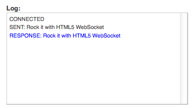

### おまけ

#### JavaFX UI

通常のInteropコールを使ってJavaFX UIを作る:

@@@ ruby chapter03x/simple-javafx/src/javafx/core.clj @@@

simple-javafxプロジェクトのフォルダへ行き、以下のコマンドでそのまま実行することが出来ます:

    lein run

以下の空っぽのウィンドウが表示されます。

#### Vaadin

以前、[Vaadin](https://vaadin.com/home)を銀行システムで使ったことがあります。

ClojureでVaadinを使うには、Clojureのコードを呼び出すJava Servletを用意する必要があります。

そのservletがこれです:

@@@ ruby chapter03x/simple-vaadin/src/vaadin/servlet.clj @@@

次に、Clojureの中にVaadinアプリケーション・オブジェクトを定義します:

@@@ ruby chapter03x/simple-vaadin/src/vaadin/nico.clj @@@

以下のコマンドでスタートします:

    lein run

これで、Vaadinのアプリケーションが起動しました:

ボタンをクリックすると、*Button$ClickListener*を経由して:

#### Lein-exec: Clojureスクリプト

[lein-exec](https://github.com/kumarshantanu/lein-exec)はClojureスクリプトを実現するLeiningenプラグインです。

*profiles.clj*にプラグインを書いて、lein-execをインストールします:

    {:user {:plugins [[lein-exec "0.3.0"]]}}

これで、下記のショートカットがLeiningenで使えるようになりました:

    lein exec -e <string-s-expr>

実際にコマンドを入力して試してみましょう:

    lein exec -e "(println (+ 1 1))"
    > 2

ファイルに書いたスクリプトを実行することもできます。 以下は引数で渡された数値の階乗を計算します:

@@@ ruby chapter03x/lein-exec/factorial.clj @@@

このスクリプトを以下のように実行すると、20の階乗が出力されます:

    lein exec factorial.clj 20
    > 2432902008176640000

##### スクリプトコマンド

Unix系の環境では、さらに便利な使い方があります。 上記のfactorial.cljファイルの先頭には以下のように書かれています:

    #!/bin/bash lein-exec

必要なファイルをダウンロードし、classpathに含まれる場所に置きます:

    $ wget https://raw.github.com/kumarshantanu/lein-exec/master/lein-exec
    $ wget https://raw.github.com/kumarshantanu/lein-exec/master/lein-exec-p
    $ chmod a+x lein-exec lein-exec-p
    $ mv lein-exec lein-exec-p ~/bin  # assuming ~/bin is in PATH

スクリプトファイルの属性を実行形式に変えたら、実行してみましょう:

    ./factorial.clj 20
    > 2432902008176640000

##### スクリプトコマンドの依存関係

Leiningenのpomegranateライブラリによって、動的に依存関係を解決することができます。

Ringアプリケーションを作成するために以下のようにコールします:

    (use '[leiningen.exec :only  (deps)])
    (deps '[[ring "1.2.0-beta1"]])
    (deps '[[compojure "1.1.5"]])

これにより必要な依存関係がダウンロードされます。

後はスクリプトを実行すると:

    ./ring.clj

フルスペックのWebサービス・アプリケーションが起動します。

##### パっと作るWebsocket

上記のRingサンプルに、ちょっと前にやった*http-kit*を使ってチャットルームを作ってみました。

以下のコマンドで実行します:

    ./async.clj

ブラウザが開くので、websocketによる通信を試して下さい:

*async.clj*にはJSONを返すハンドラーも含まれています。

以下のURLにアクセスします:

    http://localhost:8090/tellme.json

結果は以下の通りです。

