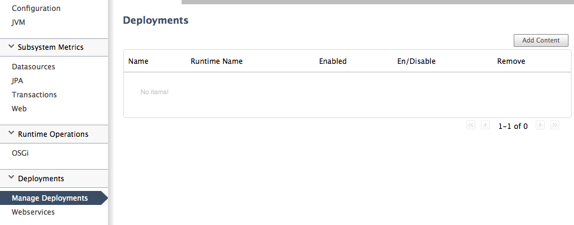
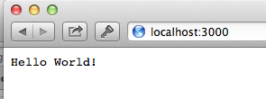

## Clojureでお手軽、チョー楽しいWeb開発

###### プラ（Plat） ポワソン:メインのお魚料理

### Lord of the Ring：Web開発の最強パートナー

[Ring](https://github.com/ring-clojure/ring) はライブラリというか、RubyのRackに触発されたライブラリセットです。

Ring はローレベルのフレームワークなのでインポートして使いたいものだけ使うのですが、逆に言うとキチっとコンセプトを理解する必要があるということです。

#### コンセプト
Ringアプリケーションのコア・コンポーネント:

##### ハンドラ

Ringハンドラはインプットのリクエストマップを受け取り、レスポンスマップを返すClojure関数です。 シンプルな例を挙げると:

    (defn what-is-my-ip [request]
      {:status 200
       :headers {"Content-Type" "text/plain"}
       :body (:remote-addr request)})

##### リクエスト

Ringリクエストはシンプルなマップです。 キーには以下のものがあります:

* :server-port リクエストを処理するポート
* :server-name 解決されたサーバ名、またはIPアドレス
* :remote-addr クライアントのIPアドレス、またはリクエストを送信した最終のプロキシ
* :uri リクエストURI
* :query-string クエリ文字列(もしあれば)
* :scheme トランスポート・プロトコル http または https.
* :request-method HTTP リクエストメソッド :get、:head、:options、:put、:post、:delete のいずれか
* :content-type リクエストボディのMIMEタイプ (分かっている場合)
* :content-length リクエストボディのバイト数 (分かっている場合)
* :character-encoding エンコーディング (分かっている場合)
* :headers ヘッダ値に一致する小文字のヘッダ名文字列の Clojureマップ
* :body リクエストボディ (存在する場合)

##### レスポンス

Ring レスポンスは３つのパラメータで構成されるマップです:

* :status HTTP ステータスコード  例：200、302、404、...
* :headers HTTPヘッダ名のClojureマップ
* :body レスポンスボディ  下記のいずれか:
** 文字列
** ISeq
** ファイル
** 入力ストリーム

##### ミドルウェア

ミドルウェアは少なくとも一つのハンドラを受け取り、ハンドラとして振る舞う関数を返す高レベルの関数です。 例えば、Ringではパラメータ、セッション、ファイルのアップロードはミドルウェアによって処理されます。

#### Ring の世界

お決まりの HelloWorld サンプルを動かすために、Ringをプロジェクトに追加します:

    [ring "1.1.8"]

そして、リクエストを処理するためのRingハンドラが必要ですね。

@@@ ruby chapter04/src/chapter04/core.clj @@@

ここで、HTTPレイヤーの処理が必要ですが、サンプルではJVMで動くWebサーバとしては大変信頼性のあるJettyを使っています。 Jettyは*ring*パッケージに含まれてるので、インストールや依存関係の設定をする必要はありません。

以下のコードでサーバをスタートします:

@@@ ruby chapter04/src/chapter04/jetty.clj @@@

[http://localhost:3000](http://localhost:3000) にアクセスしてみましょう。 Ringの世界にようこそ！

#### Ring の世界 2: leiningen を使う

さて、WebアプリケーションをいちいちREPLから起動するのもちょっと面倒ですね。 そんな大げさなことをしなくても、もっと手軽に出来ないものでしょうか？

project.clj ファイルに以下の２行を追加しましょう:

      :plugins [[lein-ring "0.8.3"]]
      :ring {:handler chapter04.core/handler}

これで何が変わるかというと、[lein-ring](https://github.com/weavejester/lein-ring)というleiningenのプラグインが使えるようになり、２行目では呼び出されるハンドラを指定しています。

では、ウェイター、、、ではなくサーバを呼びましょう:

    lein ring server

以下のように表示されたでしょうか？

コードを変更したときにWebアプリケーションを再起動する必要の無いことに注意してください。 ハンドラのコードを変更したら、すぐにそれが反映されますね！

アジャイル・ワインとでも呼びましょうか。

#### Compojure による HTTPルーティング

##### セレブにルーティング

Webアプリケーションの基本は分かりました。 って言っても、毎回HelloWorldばかりを見ているわけにも行かないので、もう少しセクシーなアプリケーションにしましょう。

まずは、[Compojure](https://github.com/weavejester/compojure) を使ってサンプルをやってみましょう [sample app](https://github.com/weavejester/compojure-example).

依存関係のリストを見ると Compojure はRingに含まれていますが、念のため、project.cljに以下の設定をしておきましょう:

    [compojure "1.1.5"]
    [hiccup "1.0.2"]

第1章で使った hiccup も設定に加えています:

@@@ ruby chapter04_01/project.clj @@@

このアプリケーションには、ルーティングの定義をするファイルとビューの定義をする２つのファイルがあります。

まず、ルーティング部分です:

@@@ ruby chapter04_01/src/compojure/example/routes.clj @@@

ルーティングは、４つのパートに別れた行ベースのDSLで記述されています:

    (GET "/" [] (index-page))

GET : 最初のパートはHTTPのメソッドで、この場合はGETです。 ANYはすべてに合致します。

"/" : ルートパス ２番目のサンプルでは、"/user/:id"というパターンを使ってパラメータを受け取っています。

[] : リクエストマップからの情報を受け取る配列

(index-page) : 第1章で見たようにhiccupがhtmlを生成するためのシンプルなClojure関数。 関数の実際の中身はこんな感じ:

@@@ ruby chapter04_01/src/compojure/example/views.clj @@@

これで準備ができました。 先ほどと同じメソッドを使ってサーバをスタートしましょう:

    lein ring server

さて、ルーティングが出来たとなると、次はJSONを使ったWebサービスでしょうか？ ここではやりませんが、ぜひチャレンジしてみてください。 以前に使ったライブラリ *cheshire* をインクルードして、レスポンスの中で適切なcontent-typeをセットし、JSONマップを返すようにすれば出来ると思います。

##### Clojureのデータ分解機能について

良い機会なので、一連のデータから必要なものだけにアクセスするClojureの*destructuring*について説明しましょう。

ルーティングDSLの２番目のパラメータ、[]を思い出してください。

    (GET "/" [] (index-page))

例えば、訪問者のIPアドレスを取得したいとします。 その場合、リクエスト自体のマップのサブセットを作成する分解フォームとして２番目のパラメータを使うことが出来ます。 少し前に、リクエストはシンプルなマップであると説明しました。 上記のサンプルをちょこっと変更して:

    (GET "/yourip" {ip :remote-addr} (str "Your IP is:" ip))

元々のリクエストマップから、:remote-addrパラメータを受け取ります。 でも、待って。 元々のリクエストマップって何でしたっけ？ これです:

@@@ ruby chapter04_01/resources/public/request-sample.json @@@

Ringサーバをスタートしているのであれば、以下のアドレスに直接アクセスして見ることもできます:

    http://localhost:3000/request-sample.json

次は、セキュリティ関連です。

#### Friend: Facebookの友達を認証する

[Friend](https://github.com/cemerick/friend) はシンプルさを以てClojureにポートされたRackのwarden、JavaのSpring Securityです。 これを使って、お友達をたくさん作って世の中をもっと良くしましょう。

最近のWebアプリケーションの傾向として、サービスにいちいち個別にログインするのではなく、GoogleやTwitter等他のサービスのログイン情報を再利用しています。 このレシピのゴールは、Facebookにログインした後で、Facebookのログイン情報を受け取ることです。

[friend oauth](https://github.com/ddellacosta/friend-oauth2) が正にそれをやってくれます。 簡単なコンフィギュレーションを通して、oauthを再作成します。

いくつかのライブラリをインポートして、サンプルです:

@@@ ruby chapter04_02/src/friend_oauth2_examples/facebook_handler.clj @@@

アプリケーションのコンフィギュレーション自体はシンプルなマップです:

    (def client-config
      {:client-id "233100973389749"
       :client-secret "0772afb21ddf0d0fab8200c1ff707319"
       :callback {:domain "http://localhost:3000" :path "/facebook.callback"}})

コンフィギュレーションの中身は、[Facebook developer page](https://developers.facebook.com/) のアプリケーション設定に合わせてください。

以下のコマンドでRingハンドラをスタートします。

    lein ring server

以下のアドレスにアクセスすると、

    http://localhost:3000/authlink

oauthのワークフローが開始され、Facebookのログインページにリダイレクトされます:

ログインに成功すると、FacebookはローカルのRingサーバの最初にポイントしたロケーションにリダイレクトします。 シンプルですね。

サンプルはgithubと.Net版があるので宿題としてやってみてください。

#### フォーム、バリデーション、バウンス

このレシピでは、どのようにフィールドのバリデーションを行うかについて見てみましょう。

Clojureでは、マップとコレクション上でバリデーションを行うのが簡単です。 おしゃれなナイトクラブでは、厳ついお兄さんのバリデーションに引っかかるとお店に入れないわけですが、そこにはきっと「サンダル厳禁」とか「泥酔してたら駄目」とかバリデーションのルールというものがあるのでしょう。 Bouncerも与えられたルールに沿ってバリデーションを行います。

project.clj に追加する設定は以下の通りです:

    [bouncer "0.2.3-beta1"]

サンプルでは以下のことを行っています:

* シンプルなルールでハッシュマップを検証
* バリデータを定義し、それを使ってハッシュマップを検証
* 最後に、正規表現のマッチングに加えて、サブコレクションの検証

@@@ ruby chapter03/src/validation.clj @@@

データセットが無事検証されれば最初の要素はnilとなり、検証に失敗すればパラメータのマップが返されます。

#### 世界のJSON

今どきはJSON抜きではWebサービスを語れない、っていうか作れないですよね。 かつてはリモートサービスを利用するのがあれこれ面倒だったこともありますが、今では [ring-json](https://github.com/ring-clojure/ring-json) が全てのお膳立てをしてくれます。

いつものようにプロジェクトに追加します:

    [ring/ring-json "0.2.0"]

以下の通り、これだけのコードで何もしなくてもClojureのデータ構造を適切なJSONに変換してくれます:

@@@ ruby chapter04_03/src/chapter04_03/core.clj @@@

コードでは、まずネームスペースにRingのミドルウェアをインポートし、*wrap-json-response*というメソッドをRIngのハンドラに設定しています。 それだけです。

[http://localhost:3000](http://localhost:3000) のサーバにアクセスすると、フォーマットされたJSONコードが返されます。

２番目のサンプルでは、サービスにJSONのデータをポストし、直接Clojureのデータ構造を取得します。

サーバサイドのコードも決して複雑ではありません:

@@@ ruby chapter04_03/src/chapter04_03/core2.clj @@@

以下のように、コマンドラインでCurlを使ってサービスにリクエストを送ります:

    curl -v \
        -H "Accept: application/json" \
        -H "Content-type: application/json" \
        -X POST \
        -d '{"user":"Clojure"}'  \
        http://localhost:3000

次のJSONが:

    {"user":"Clojure"}

ミドルウェアのwrap-json-bodyによって以下のように変換されます:

    {"user" "Clojure"}

Merci Monsieur !

#### Ringの世界 3: スタンドアロン・サーバ

上記で見た lein-ring コマンドを使うことで、スタンドアロンのカスタマーWebサーバを生成することができます！
以下のように実行します:

    lein ring uberjar

これで関連するたくさんのインストールが始まります:

    Created /Users/Niko/projects/mascarpone/chapter04/target/chapter04-0.1.0-SNAPSHOT.jar
    Including chapter04-0.1.0-SNAPSHOT.jar
    Including java.classpath-0.2.0.jar
    Including ring-refresh-0.1.2.jar
    Including clj-stacktrace-0.2.5.jar
    Including servlet-api-2.5.jar
    Including ns-tracker-0.2.1.jar
    Including javax.servlet-2.5.0.v201103041518.jar
    Including ring-servlet-1.1.8.jar
    Including ring-server-0.2.8.jar
    Including clojure-1.5.0-RC3.jar
    Including clout-1.0.1.jar
    Including core.incubator-0.1.0.jar
    Including ring-1.1.8.jar
    Including tools.macro-0.1.0.jar
    Including commons-io-2.1.jar
    Including ring-devel-1.1.8.jar
    Including clj-time-0.3.7.jar
    Including hiccup-1.0.0.jar
    Including watchtower-0.1.1.jar
    Including ring-core-1.1.8.jar
    Including jetty-http-7.6.1.v20120215.jar
    Including jetty-util-7.6.1.v20120215.jar
    Including ring-jetty-adapter-1.1.8.jar
    Including commons-codec-1.6.jar
    Including joda-time-2.0.jar
    Including compojure-1.1.5.jar
    Including jetty-server-7.6.1.v20120215.jar
    Including jetty-io-7.6.1.v20120215.jar
    Including tools.namespace-0.1.3.jar
    Including commons-fileupload-1.2.1.jar
    Including jetty-continuation-7.6.1.v20120215.jar
    Created /Users/Niko/projects/mascarpone/chapter04/target/chapter04-0.1.0-SNAPSHOT-standalone.jar

少し前にやった *uberjar* を覚えてますか？ これは *uberjar* のRingバージョンです。 これで、簡単にデプロイが出来て、誰でも自分のマシン上でこのサーバを実行することが出来ます。

通常のやり方で実行します:

    java -jar target/chapter04-0.1.0-SNAPSHOT-standalone.jar

#### Ringの世界 4: いつものWebサーバにデプロイする

パッケージと言えば、Javaの世界にはもう一つ *web archive* あるいは war ファイルがありますね。

では、war専門のウェイターを呼んでみましょう:

    lein ring uberwar

彼のレスポンスは:

    Created /Users/Niko/projects/mascarpone/chapter04/target/chapter04-0.1.0-SNAPSHOT-standalone.war

ということで、いつものJava Webサーバのdeploymentディレクトリにコピーするためのwarファイルが出来上がりました。

##### Apache Tomcat 7

JBossは多機能でデプロイのオプションも豊富にあるので、この次のレシピはちょっと長いのですが、その前にさらっとApache Tomcatの話を済ませましょう。

Apache Tomcat はJVMベースのサーバデプロイメントをもう長いことサポートしています。
むかしむかし、ブドウがまだまだ若かった頃、本番システムの運用にTomcat 3を紹介したことがあります。 メモリの使用効率が良く、多くのコネクションを処理出来、その頃の有償のサーバに比べても遜色無く、コストを節約することが出来ました。

[download Tomcat](http://tomcat.apache.org/download-70.cgi) からダウンロードして解凍します。 サーバのスタートは:

    ./bin/startup.sh

Tomcatをインストールしたフォルダにあるwebappフォルダに先ほどのwarファイルをコピーし、アクセスしてみましょう:

    http://localhost:8080/chapter04-0.1.0-SNAPSHOT-standalone/

まだ時間通りですね！

Tomcatは後でまた使いますので、環境を残しておきましょう。

##### JBoss AS 7

数年前は、ちょっと進んだことをやっているところはどこでもJBossを使っていました。 たくさんの友人がクールなプロジェクトに関わっていて、JBossに数ステップでwarファイルをセットアップ出来たら彼らの役に立つかな？なんて考えていました。

[projects page](http://www.jboss.org/projects) か [direct download page](http://www.jboss.org/jbossas/downloads/) からサーバをダウンロード出来ます。

ダウンロードした中身は、以下のような感じです:

この本はJBossの本ではないので、JBossの詳細については専門の書籍かJBossのドキュメントを参照してください。

JBossの管理コンソール使うためにはユーザを追加する必要があります。 binフォルダにある*add_user.sh*というスクリプトを使ってユーザを作りましょう。

ちょっと古くさい感じがしますが、スクリプトを実行例です:

    [Niko@Modrzyks-MacBook-Pro][17:58][~/Downloads/jboss-as-7.1.1.Final/] % ./bin/add-user.sh

    What type of user do you wish to add?
     a) Management User (mgmt-users.properties)
     b) Application User (application-users.properties)
    (a):

    Enter the details of the new user to add.
    Realm (ManagementRealm) :
    Username : clojure
    Password :
    Re-enter Password :
    About to add user 'clojure' for realm 'ManagementRealm'
    Is this correct yes/no? yes
    Added user 'clojure' to file '/Users/Niko/Downloads/jboss-as-7.1.1.Final/standalone/configuration/mgmt-users.properties'
    Added user 'clojure' to file '/Users/Niko/Downloads/jboss-as-7.1.1.Final/domain/configuration/mgmt-users.properties'

これでブラウザを使って管理コンソールにアクセスする準備が出来ました。 まずは、サーバをスタートしましょう:

    ./bin/standalone.sh

そして、ブラウザから下記にアクセスしてみましょう:

    http://127.0.0.1:9990/console/App.html#server-overview

認証の画面が表示されます。

さっき作成したユーザとパスワードを使ってログインします。

以下のスクリーンショットを参考にwarファイルをJBossにアップロードします。

最後にアプリケーションを有効にします:

アプリケーションはwarファイル名をデフォルトのコンテキストとするので、以下のURLでアクセスしてみましょう:

    http://localhost:8080/chapter04-0.1.0-SNAPSHOT-standalone/

無事に時刻が表示されたでしょうか？ さっきよりずいぶんと時間が経ちましたね。 そろそろ、次のワインも届くでしょう。

ここでお伝えしたいのは、かつてはJavaで作ったフルスペックのショッピングサイトが、今や新しいけどパワフルでシンプルなClojureで作れてデプロイ出来てしまうということなんです。 これだったら、文句を言うデベロッパはあまりいないんじゃないんでしょうか？

### Java WebサーバのボスJBossのClojure版: Immutant

#### まさに野獣

前のセクションでは通常のJBossをどのように使い、デプロイするかを見てきましたが、このセクションではJBossの特別バージョンを紹介したいと思います。

[Immutant](http://immutant.org/tutorials/installation/index.html) は不要な複雑さを排除し、あなたに必要な機能だけにしたおそらくClojureにとって理想的なものでしょう。

Immutant はプラグインなので、profiles.clj の中に追加しましょう:

    {:user {:plugins [[lein-immutant "0.17.1"]]}}

それでは、Ring アプリケーションをどのように作成し、どのようにImmutant/JBossサーバにデプロイするのかを見ていきましょう。

以下のコマンドで、Leiningen がローカルマシンにサーバをダウンロードしてくれます:

    lein immutant install

サーバがダウンロードされ、解凍されますので、新しいプロジェクトを作成しましょう:

    lein immutant new chapter04_05

続いて、プロジェクトでRingハンドラを使うための設定をします。

プロジェクトのメタデータにringとring-jsonを追加します:

    [ring/ring-json "0.2.0"]

そして、jsonを返すRingハンドラ:

@@@ ruby chapter04_05/src/chapter04_05/core.clj @@@

ここまで特に変わったことはしていませんが、immutantに追加したファイルはsrcフォルダのimmutantフォルダにあります。

@@@ ruby chapter04_05/src/immutant/init.clj @@@

これで、"/"に対するハンドラが設定されました。 メッセージング、キャッシング、スケジューリングなどの設定もこのファイルで行います。

以下のコマンドでデプロイを行います:

    lein immutant deploy

デプロイコマンドは物静かなようで、あまり多くを語りません...

    Deployed chapter04_05 to /Users/Niko/.lein/immutant/current/jboss/standalone/deployments/chapter04_05.clj

でも、アプリケーションはちゃんとデプロイされているようです。

では、別のシェルを開いて、以下のLeiningenコマンドでImmutantを実行してみましょう:

    lein immutant run

そしてついに待ちわびたJSONがここに:

    http://localhost:8080/chapter04_05

foo と bar ですね。

    {
    "foo": "bar"
    }

少し説明すると、immutantへはプロジェクトそのものをコピーしているわけではなく、プロジェクトへの参照をコピーしています。 そして、デプロイされたファイルはここにあります:

    {:root "/Users/Niko/projects/mascarpone/chapter04_05"}

ということは、コードを更新出来るということです。 試しに以下のようにコードを変えてみてください:

    (defn handler [request]
       (response {:foo "bar me"}))

#### 無駄遣いはやめて、無料のキャッシングを試す

Immutantを使うと基本お金はかかりません。 加えて、こんなのもあります [caching](http://immutant.org/tutorials/caching/index.html). タダですよ、タダ！

キャッシング用のコードを書いて、新しいハンドラを定義します:

@@@ ruby chapter04_05/src/chapter04_05/caching.clj @@@

これで、アプリケーションに新しいコンテキストを追加することが出来ます:

    (web/start "/app" app)
    (web/start "/cached" cached)

すると、キャッシュされた値が得られます。

ま、ワインはあまりキャッシュされない方が良いですけど。。

### 一瞬でWebプロジェクトを立ち上げる: Leiningen用テンプレートLuminus

テンプレートって色んな場面で話に出てきますが、正直よく分からないことがありますね。。

[Luminus](http://www.luminusweb.net/) は手軽にプロジェクトをスタート出来るところから [noir](http://www.webnoir.org/) から火のついたフレームワークです。

インターネットを探すと、Noirについては未だに色々な情報を散見できます。 ClojureのWebコミュニティが始める必要があったとか。
問題はほとんどのRingプラグインに対して互換性がないことで、したがって手軽にアプリケーションを立ち上げるというわけには行かないのです。

Ringについては、この章で見てきたことはその一部に過ぎませんが、Luminusを使ってそれらを一つにパッケージしてみましょう。

[luminus](https://github.com/yogthos/luminus-template) と名前のLeiningenのテンプレートを使い、新しいWebプロジェクトを立ち上げます。

新しいLeiningenのプロジェクト用テンプレートは [newnew](https://github.com/Raynes/lein-newnew) と呼ばれる内部プラグインを使用しています。 Newnew は実際はそう新しくありませんが、今ではLeiningenに含まれています。 ですので、特にインストールを行う必要はありません。

それでは、以下のコマンドで新しいプロジェクトを作成しましょう:

    lein new luminus chapter04_06

そして、、、これだけです。 プロジェクトのフォルダに移動してサーバを起動しましょう:

    lein ring server

ブラウザで開いてみると...

コーディングする準備が出来ました。

Luminus はルーティング、マークアップ、データベース、Twitter連携等、大抵のRingライブラリを統合してくれます。 後は、コードを書くだけです！

### WebSocketの開発はラクになったのか？

サーバサイドのJavaScriptの世界では、ここのところ Node.js 順風満帆という感じですが、ClojureにもWebSocketを簡単にしてくれる素晴らしいライブラリがあります。

最近、私はサーバサイドのWebSocketにほとんどすべてこれを使っています。

実はもうすでに紹介しているのですが、http-kitです。 まずは、project.cljに追加しましょう:

    [http-kit "2.0.0-RC4"]

私はまた、leinでプロジェクトをスタートするときに :main ディレクティブを追加しています:

    :main chapter04-07.core

そして、とても短いコードはこちら:

@@@ ruby chapter04_07/src/chapter04_07/core.clj @@@

下記のWebSocketのテストサイトを使って:

    http://www.websocket.org/echo.html

ローカルのURLを指定します:

    ws://localhost:8080/chat

良いでしょう？ これなら、HTML5 の WebSocket で色々出来そうじゃないですか？ ;)

これこそ Ringにバッチリ合うんじゃないでしょうか。 実際のところ、裏側ではもう少し複雑なのですが、もし詳細を知る必要があるのであれば、ぜひ時間を使ってWebサイトを見てみてください。

ノート：

[Aleph](https://github.com/ztellman/aleph) はClojureでWebSocketを使うもう一つのとても良い方法です。 Alephはより幅広いように使え、普通のプロトコル(TCPやUDP)以外のプロトコルを扱うことが出来ます。 この本の範疇からは外れますが、私は特に [UDP](https://github.com/ztellman/aleph/blob/perf/src/aleph/udp.clj) 機能がお気に入りです。

とにかく、Webには色々ありますね。

### RESTful なアプリケーションは今や当たり前

見つかったのは [Liberator](https://github.com/clojure-liberator/liberator) だけでした。。 適当に "Clojure Rest" でググったのですが、実際に興味をそそられたのは Github の Liberator でした。
ドキュメントも決して多いとは言えないのですが、ま、この本を書くためだけに調べたのですが、結果から言うと非常に良いものですた。

いつものように、シンプルなサンプルから始めます。 POSTでカウンタをインクリメントし、GETでカウンタの値を取得します。

project.clj には、Liberatorを含む以下の設定をします:

    [compojure "1.0.2"]
    [ring/ring-jetty-adapter "1.1.0"]
    [liberator "0.8.0"]

今やお馴染みの設定も忘れずに。

    :plugins [[lein-ring "0.8.3"]]
    :ring {:handler chapter04-08.core/app}

Liberator では与えられた決定木に基づいたRestful *resources* のコンセプトを定義します。

一番簡単なリソースの定義は、*resource* キーワードを使います:

    (resource :handle-ok "Hello World!")

リソースは戻り値として使うだけではなく、属性も指定することでリクエストに対するレスポンスとしても使います:

    (resource :available-media-types ["text/plain"] :handle-ok "Hello World!")

そして、Compojureのルーティングにこのリソースを設定します:

    (ANY "/" [] (resource :available-media-types ["text/plain"] :handle-ok "Hello World!"))

さて、準備はできましたがどうやって試したら良いでしょう？ 単純にブラウザでアクセスすれば良いですね。

それでは、カウンタを扱うサンプルに移りましょう。 GETとPOSTメソッドだけ実装しています。

@@@ ruby chapter04_08/src/chapter04_08/core.clj @@@

先ほどは :available メディアタイプを設定しました。 ここでは、別の設定をしましょう:

受け付けるメソッドを指定します:

    :method-allowed? (request-method-in :post :get)

次にPOSTに応答するメソッドを実装します。 このメソッドでは、カウンタをインクリメントします。

    :post! (fn [_] (swap! postbox-counter inc))

新しいリソースが生成された時、特別なメッセージを返します:

    :handle-created (fn [_] (str "Your submission was accepted. The counter is now " @postbox-counter))

最後に、GETに対してカウンタの値を返すシンプルなメソッドを実装します:

    :handle-ok (fn [_] (str "The counter is " @postbox-counter))

いい感じです。

curlコマンドを使って、POSTリクエストを送信してみましょう:

    curl -Xpost http://localhost:3000/post

すると、以下のメッセージが返ってきます:

    Your submission was accepted. The counter is now 1

ここに長いリストがあります [list of decisions](https://github.com/clojure-liberator/liberator#reference-list-of-decisions) ので、ぜひ一度目を通してRestfulを楽しんでください。

### Webのテストをもう少し

テストについてはよく考えないとなかなか効率的に出来ないですよね。 Webでのテストもまたしかり。

Ringで定義されたハンドラは非常に簡単に一連のテストを書くことができます。
この章を終わるにあたって、どのようにテストを盛り込むかを見ていきましょう。

#### 私のマネをしないで！

このレシピでは、Ringのリクエストをマネることでハンドラのリクエストの処理結果を検証する方法を紹介します。

[Ring mock](https://github.com/weavejester/ring-mock) はRingフレームワークの発案者によって開発されました。 Ring-mockでは、純粋にリクエストとその結果のマップを作成します。

プロジェクトにインクルードするには:

    [ring-mock "0.1.3"]

実際にring-mockで覚えるのは *request* ファンクションでしょう。 これがRingのリクエストをマネするファンクションです。

以下のサンプルで見てみましょう:

@@@ ruby chapter03/test/chapter03/mock.clj @@@

*your-handler* が元々のRingのハンドラです。 コードの残りの部分で、テストをするためのリクエストを設定しています。

重たいサーバは必要ありません。 コードレベルでサクっとテスト出来ます。

#### HTMLベースのRingアプリケーションのナビとテスト

このレシピでは、RingベースのHTML Webサイトのナビゲーションとコンテンツのチェックについて見てみましょう。
[Kerodon](https://github.com/xeqi/kerodon) がこのレシピに最適でしょう。

始めに、Ringハンドラで直接セッションを生成します:

    (-> (session app)
        (visit "/"))

後は、kerodonキーワードを使ってリンクを辿ったり、フォームに値を入れて送信したり、アプリケーションの様々な機能をチェックします。
ごく普通の使い方ですね。

テストを実行するにはprojekut.cljファイルにいくつかのライブラリを追加します:

    [kerodon "0.0.7"]
        ; routing
        [net.cgrand/moustache "1.2.0-alpha1"]
        ; html markup
        [hiccup "1.0.2"]

以下、サンプルです:

@@@ ruby chapter03/src/kerodon.clj @@@

※ アプリケーションはRingベースですが、ルーティングはCompojureではなく、[moustache](https://github.com/cgrand/moustache) という別のルーティングライブラリで行っています。

テストのサンプルの内容はほとんど明解だと思います。 *follow-redirect* ディレクティブについては、kerodonに対してリダイレクトが起こったことを知らせるために使用しています。

それ以外は、DSLを見ていただけばお分かりいただけると思います。

Kerodon は [peridot](https://github.com/xeqi/peridot)　ベースとしており、peridotにも見ておくべきサンプルがたくさんあります。

次は、気に入った番組を繰り返し何度も見たい時のレシピです。

#### VCR で HTTP を再生

このレシピは、自分自身ちょっと驚きました。

[vcr-clj](https://github.com/fredericksgary/vcr-clj) はRubyのVCRライブラリのClojure版です。 これを使うと、HTTPのやり取りを記録し、そのやり取りを任意に再生することができます。 例えば、同じテストを何度も繰り返し実行することが、特別な機材を別に用意すること無く出来てしまうのです。

プロジェクトに取り込むには:

    [com.gfredericks/vcr-clj "0.2.2"]

このテストでは、jettyサーバを使いますが、それを簡単にするためにちょっとしたコードを書きます。 (本来はライブラリそのものにあって然るべきだと思いますが ...)

では、サンプルを見ていきましょう:

@@@ ruby chapter03/src/vcr.clj @@@

テストで最も重要なのは *with-cassette* の部分です。 リクエストは一旦記録してしまえば、順番を変えることが出来ます。 例えば、/foo、/barだったのを/bar、/fooに。

    (with-cassette :bar-bar
      (is (= "foo" (get "/foo")))
      (is (= "bar" (get "/bar"))))
    (is (= 2 (count (server-requests))))
    (with-cassette :bar-bar
      (is (= "bar" (get "/bar")))
      (is (= "foo" (get "/foo"))))

ここで、 *get* は通常の httpクライアントです。

### "世界が終わる日" - R.E.M

RubyやPythonは書く喜びを与えてくれました。 そして、Clojureは書くことに夢中にさせてくれます。

この章では、色々なことをどうやって一つにまとめるかを見てきました。

* Ringアプリケーションを作成し、リクエストを処理する
* リクエストをアプリケーションにルーティングする
* 認証する
* サーバとJSONを透過的に扱う
* 運用サーバにデプロイする
* サクっとWebSocketを書く
* REST APIを実装する
* アプリケーションをテストする

では、本を一旦閉じて、自分のWebサイトにプログラマブルなページを追加してみましょう！
