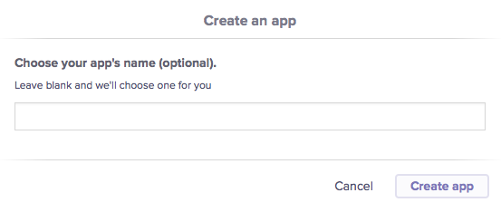
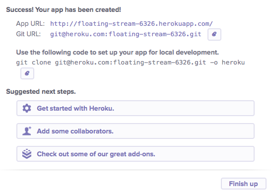
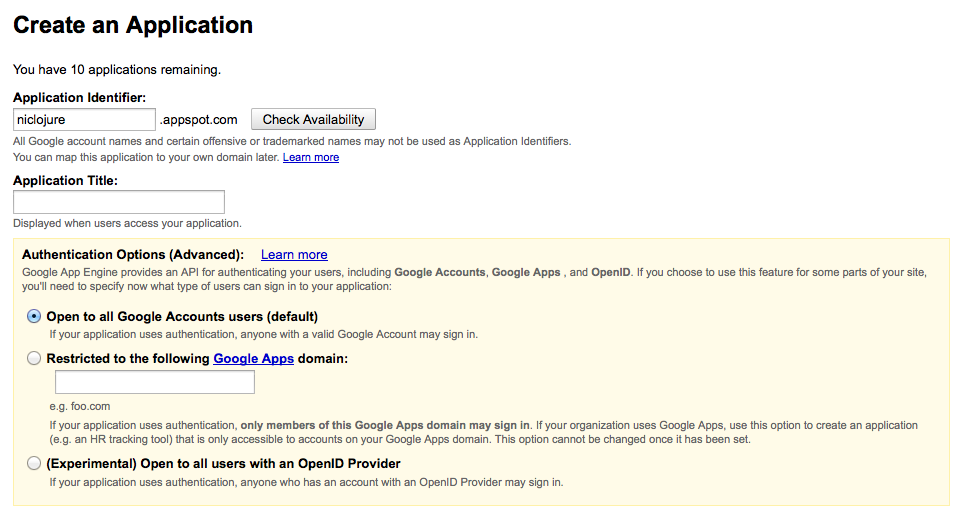
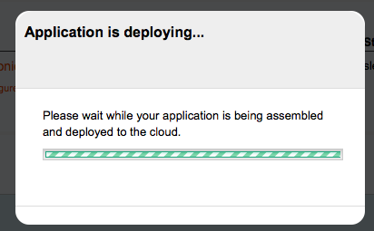

## クラウドとClojure、明るい日々

### 5分でHerokuにデプロイする。

このレシピでは、[Deploying Clojure Web Application on Heroku](https://devcenter.heroku.com/articles/clojure-web-application) に書かれている素晴らしいドキュメントを紹介します。 ぜひ、オリジナルを一度参照してください。

#### 新しいプロジェクトを生成する

Heroku用のWebアプリケーションを作るために、Webの章でやったRingのアプリケーションをもう一度作成しましょう。

ここでは、luminusテンプレートを再利用し、leiningenを実行してプロジェクトを生成しましょう:

		lein new luminus test-project

以下のコマンドを実行して、プロジェクトが動くことを確認しましょう。

		lein ring server

以下のURLを確認します:

		http://localhost:3000/

herokuの第一歩は成功です。

#### Heroku toolbelt

HerokuにはToolbeltと呼ばれるツールがあります:

[https://toolbelt.heroku.com/](https://toolbelt.heroku.com/)

WindowsやMacを含む大体のプラットフォームで動作し、Herokuアプリケーションをコントロールすることができます。

* git
* foreman
* heroku Command Line Interface

上記の２番目と３番目のツールは必ずしも必要ではありませんが、日々の作業を楽にしてくれます。 Herokuは基本的にGitベースなので、Gitのインストールは必須です。

#### SSH でのアクセスを準備する

すでにsshがあるなら、herokuのアカウントに追加しましょう。 以下のページに、公開鍵をコピーします:

[https://dashboard.heroku.com/account](https://dashboard.heroku.com/account)

もう一つの方法は、Toolbeltを使って以下のコマンドでHerokuにログインします:

		heroku login

herokuのeメールとパスワードを入力すると、herokuにログインし、Heroku サービスの認証を行います。

最後に、SSHキーを作成する場合の方法です。

新しいSSHキーのセットは、以下のコマンドで生成します:

		 ssh-keygen -t rsa -f ~/.ssh/id_rsa_heroku

生成されたキーをローカルのsshエージェントに追加します:

		ssh-add ~/.ssh/id_rsa_heroku

以下のコマンドを実行したときに、追加したキーが表示されることを確認します:

		 ssh-add -l

不要なキーは -d フラグを指定して削除します (sshエージェントからは削除されますが、キーそのものは削除されません。)

		ssh-add -d /Users/Niko/.ssh/id_rsa_hellonico

キーをアカウントに追加する:

[https://dashboard.heroku.com/account](https://dashboard.heroku.com/account)

これで、認証が出来ました。 次はいよいよherokuのセットアップです。

#### herokuのセットアップ

Herokuの新しいアプリケーションを作成します。 再度、herokuのアカウントページに移動し、以下の手順で新しいアプリケーションを作りましょう:

Clojureのアプリケーションに戻って、必要なリモートのgitを追加します。

		git remote add heroku git@heroku.com:glacial-tundra-7926.git

次に、gitのpushを実行します:

		git push heroku master

これで、我々のアプリケーションがクラウドで実行できるようになりました:

[http://glacial-tundra-7926.herokuapp.com/](http://glacial-tundra-7926.herokuapp.com/)]

ちなみにHerokuのToolbeltを使うと、同等のことを以下のコマンドで実行できます:

		heroku apps:create

#### ちょっと説明

Heroku はAmazon AWSで動いており、色々な面倒なことをあなたの代わりにやってくれます。 Herokuは [Foreman gem](ddollar.github.io/foreman/) をベースにしたRubyベースのインフラに大きく依存しています。

アプリケーションに対してHerokuが何をすべきかを伝えるには _Procfile_ ファイルが必要です:

		web: lein with-profile production trampoline ring server

次のように省略して書くことも出来ます:

		web: lein ring server

これは以前我々が使用したコマンドを含んでいます。 RingベースのClojure Webアプリケーションを実行する一番シンプルなバージョンです。

先ほどインストールしたToolbeltはHerokuと同じやり方でローカルにアプリケーションを実行することができるForemanユーティリティを含んでいます。
		foreman start

#### オフスクリプト

chapter06/test-heroku のサンプルでは、シンプルなフィボナッチのスクリプトを使いました:

@@@ ruby chapter06/test-heroku/src/demo.clj @@@

このスクリプトをHerokuのインフラでオフスクリプトとして実行することができます。

プロジェクトフォルダからローカルにスクリプトを実行するには:

		lein trampoline run -m demo 100

これをHerokuで走らせるには、プレフィックスコマンドを追加します:

		heroku run lein trampoline run -m demo 100

※ Heroku Toolbeltがインストールされ、herokuコマンドにパスが通っていること

詳細は [one-off script](https://devcenter.heroku.com/articles/clojure#oneoff-scripts) を参照してください。

#### HerokuでもっとClojure、リアルタイムでデバッグ

HerokuでClojureアプリケーションを動かすためのTipsを見てきました。 少しでも興味を持ってもらえたら良いのですが。

この本ではここまでずっと実際にコードを動かしながら進めてきて、飲んだワインもかなりの量になりましたね。 ここでは、REPLに接続するとても画期的な方法を紹介しましょう。

このレシピは [Debugging clojure on Heroku](https://devcenter.heroku.com/articles/debugging-clojure) に触発されて書きました。

まず、gitでコードをチェックアウトします:

		git clone https://github.com/technomancy/chortles.git

Chortles はワールドワイドウェブのオフィシャルアプリケーションで:

		HTTPとJSON経由で笑いの規模を計算する

アプリケーションのクローンが準備出来たら、Herokuの自分のアカウントにセットアップしましょう:

		heroku apps:create

新しいアプリケーションがアカウントに登録されるので、以前にも使ったherokuのコマンドでpushしましょう:

		git push heroku master

他の人にコードをいじられないように、プライバシー設定も
しておきましょう:

		heroku config:set AUTH_USER=nico AUTH_PASS=nico

このコマンドを使えば、Herokuで動かすアプリケーションに必要なシステム環境の設定を行うことが出来ます。

### Google App Engine へデプロイするときのメモ

Google App EngineにClojureアプリケーションをデプロイするには主に２通りの方法がありました。

* [AppEngine-magic](https://github.com/gcv/appengine-magic)
* [Gaeshi](https://github.com/slagyr/gaeshi)

が、最初の方法はちょっと古く、２番目の方法はここのところ廃れ気味です。。

だったら、何かいい方法がないかググってみましょう。 もしかしたら、あなた自身が何かいい方法を思いつくかも知れませんね！

#### ということで、Gaeshi

まず、あまり手のかからなそうなGaeshiを試して、５分でアプリケーションをGAEにデプロイしてみましょう。

最初に、以下の場所からGoogleが提供しているコマンドラインツールをダウンロードしましょう:

[https://developers.google.com/appengine/downloads](https://developers.google.com/appengine/downloads)

このツールは直接使用はしませんが、展開して、後で使うのでパスをメモっておきましょう。

~/.lein/profiles.clj にLeiningenのプラグインを追加します。

		{:user {:plugins [
									[gaeshi/lein-gaeshi "0.10.0"]
									...
									]}}

これで、新しいプロジェクトを１から作る準備が整いましたので、新しく追加したプラグインを使っていくつかコマンドを実行しましょう:

		lein gaeshi new test_1
		cd test_1
		lein gaeshi server

以上で、google app engineがローカルに複製されましたので、直接それを使って開発することが出来るようになりました。

ブラウザで下記URLにアクセスしてみましょう:

[http://localhost:8080/](http://localhost:8080/)

もしもGaeshiのオプションを確認したければ、下記を参考にヘルプを表示してください:

		gaeshi/lein-gaeshi 0.10.0: Command line component for Gaeshi; A Clojure framework for Google App Engine.
		Usage: [lein] gaeshi [options] <command> [command options]
			command  The name of the command to execute. Use --help for a listing of command.
			-v, --version  Shows the current joodo/kuzushi version.
			-h, --help     You're looking at it.
			Commands:
			deploy    Deploy the project to Google AppEngine
			generate  Generates files for various components at the specified namespace:
										controller - new controller and spec file
			help      Prints help message for commands: gaeshi help <command>
			new       Creates all the needed files for new Gaeshi project.
			prepare   Build a deployable directory structure of the app
			server    Starts the app in on a local web server
			version   Prints the current version of gaeshi/lein-gaeshi

#### Googleの準備

下記の場所から、Google App Engineのアプリケーションを作りましょう:

[https://appengine.google.com/start/createapp](https://appengine.google.com/start/createapp)

画面の表示に従って、アプリケーションを作成します。 この本の読者であれば、おそらく簡単に完了するものと思います:

アプリケーションの名前は後で再利用出来ますが、とりあえず覚えておきましょう。

#### アプリケーションをGoogle App Engineにアタッチする

以下のファイル

		config/production/appengine-web.xml

のドメイン名を確認します： <application>sub_domain_name</application>
例えば、アプリケーションに pure_natto　という名前を付けたのであれば、上記の表記は、

		<application>pure-natto</application>

となり、GAEでのドメインは pure-natto.appspot.com となります。

		最後に、~/.gaeshi/ にClojureのプロジェクト名と同じ名前の設定ファイルが必要です。

プロジェクトの名前が test-1 なら、設定ファイルは

		~/.gaeshi/test-1

となります。 ファイルの中身は以下のようになります:

		{
		:appengine-sdk-dir "/path/to/appengine-java-sdk-1.4.3"
		:appengine-email "sato.satoshi@gmail.com"
		:appengine-password "yourpassword"
		}

これで準備は終わりです。 Gaeshiプラグインを再度実行してデプロイしましょう:

		lein gaeshi deploy production

数秒の後、下記のURLでアプリケーションを確認出来ます:

		http://<application_name>.appspot.com/

このドキュメントの古いバージョンをオンラインでみることが出来ます:

		http://gaeshidocs.appspot.com/

見てみてください。

#### 制限

既にご存知かも知れませんが、GAEはスレッドに関して重要な制限があり、仮想的に制御したり、新規に作成することが出来ません。

ということは、_clojure futures_ は使えないということです。

ですが、もしその制限を受け入れられるのであれば、GAEは信頼性やGoogleのインフラとの連携などアプリケーションのホスト環境として充分に強力な選択肢の一つとなるでしょう。

また、最近、Googleは例のGoogle GlassプロジェクトでGAEアプリケーションを使用しているので、もしかしたら色々な新しい機能が追加されたり、機能的な制限が制限でなくなったりってこともあるかも知れませんね。

### Cloudbees

[Cloudbees](http://www.cloudbees.com/) は信頼性のあるクラウドデプロイメントを提供するPaaSプロバイダです。

CloudBeesは非常にシンプルで、[brilliant page](http://blog.cloudbees.com/2011/11/easy-deployment-of-clojure-apps-on.html) でClojureアプリケーションのデプロイに関してまとめています。

まず、[Cloudbees login page](https://grandcentral.cloudbees.com/login) へ行き:

Googleのアカウントでログインします。

以下の場所から Cloudbees キーを取得します:

取得したキーを、ホームフォルダ下の以下のファイル中の:

		~/.bees/bees.config

下記２行に設定します:

		bees.api.secret=<your api secret>
		bees.api.key=<your api key>

From the Cloudbees console that you can access from the Application tab, or going through the following URL:

	https://run.cloudbees.com

Create a new application, with most of the default settings:

That's. The application container is ready in the cloud, we just have to push something to it.

I have re-used the same Ring application template as usual, and added two lines to the project.clj file.

Have a look:

@@@ ruby chapter06/cloudbees/project.clj @@@

We have the [leiningen plugin for cloudbees](https://clojars.org/lein-cloudbees):

		:plugins [
		[lein-cloudbees "1.0.4"]
		]

And the application id:

			:cloudbees-app-id "hellonico/sundayafternoon"

We can check our application and our settings are all good with:

		lein cloudbees list-apps

And finally, deploy our ring application with the simple command:

		lein cloudbees deploy

The application is ready to be accessed at:

		http://<applicationname>.<accountid>.cloudbees.net/

In this case:

[http://sundayafternoon.hellonico.cloudbees.net/](http://sundayafternoon.hellonico.cloudbees.net/)

You have 5 applications ready to be deployed for free ! So go on, and launch some great honey tasting wine with some cloud bees !

###### フロマージュ（Les fromage）: チーズ

### Amazon EC2 を直接モニタする
### システム管理やデプロイ用のクラスタとタスクを定義し、リモートで実行する
### clojure-control でClojureアプリをモニタする
### 並列 SSH
### ロビンちゃんでグラフ化モニタリング
### すぐに使えるクラウドインフラ
### クラウド管理のための簡単 VirtualBoxラッパー
### Hadoop ジョブをローカルやEMRで実行するための Lemur
### Redhat OpenShift にデプロイする
### Google App Engine
### ちょー簡単！ jetlastic でClojureアプリをクラウドでデプロイ