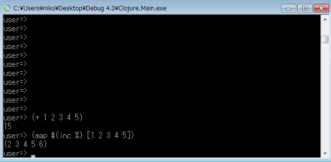
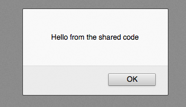
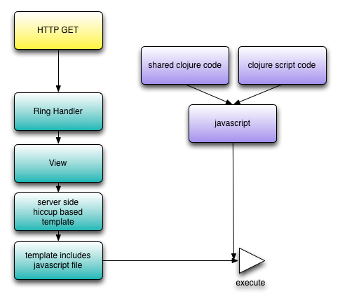

## プラットフォーム

とうとう最後の章にたどり着きました。 この本では、ここまでClojureの持つ色々な可能性について見てきました。

ここでは、Clojureのスコープを広げてみましょう。 今まではJavaのVM上でClojureを動かしてきました。 でも、もしかしたらClojureを使いたいけどJVMは使えないとか、あるいはClojureのコードをまったく違う環境で再利用したいということがあるかも知れません。

この最後の章では、まずRougeを使ってRubyのVM上でClojureのコードを動かし、その次にMicrosoft .NetのVMでシームレスにClojureを動かします。 最後は、coffeescriptのようなクールな存在になるかもしれない、JavaScriptのランタイムで動かせる新顔のClojurescriptについて。

### Ruby + Clojure = Rouge !

もしかしたら、Rougeはこの本の第1章で紹介すべきだったかも知れません。 マジで興味深いです。 以前、開発チームに質問を投げたことがありますが、彼らは即座に対応し1時間かからずに問題を修正してくれました。

なぜRougeか？

[Rouge](http://rouge.io/)はRuby VM上のClojureで2つの特長があります:

* ブートが速い (私の環境では 0.1秒)
* Rubyのgemが使える ＝ 現代的で優れたAPIが多い
* Clojure は素晴らしい！

#### はじめの一歩

RougeのREPLをオンラインで試すことが出来ます：[Try Rouge](http://try.rouge.io/)
あるいは、gemでローカルにインストールすることが出来ます:

    gem install rouge-lang
    rouge

これでとりあえずRougeでREPLが動くようになりました。

ま、まずは最初のサンプルを動かしてみましょう:

@@@ ruby chapter10/rouge/first.rg @@@

まったくもってClojureそのものですね！ そして速い！

じゃ、どんどん行きます。

#### Teenager: Clojureでgem

##### WebをMechanizeする

RubyにはMechanizeという素晴らしいgemがあります。

MechanizeライブラリはWebサイトとのやり取りを自動化するのに使われます。 Mechanizeは自動的にcookieの保存/送信、リダイレクト処理、リンクを辿ったり、フォーム送信等を行います。 フォームの項目も生成し送信します。 また、Mechanizeは訪問したサイトの履歴も取得します。

それでは、ClojureからMechanizeを使ってみましょう。

まず、gemをインストールします:

    gem install mechanize

これで、コードから直接参照出来るようになります:

@@@ ruby chapter10/rouge/mechanize-rg/test.rg @@@

以下のコマンドで実行してみましょう:

    rouge test.rg

コードの中身はJavaの時とそれほど変わりませんが、メソッドの参照はVM(この場合はRuby)の作法に従って'.'(ドット)表記を使っています。

##### Rubyのイベント

速くてシンプルなRubyプログラム用のイベント処理ライブラリ[eventmachine](http://rubyeventmachine.com/)をインストールします。

    gem install eventmachine

以下のように、ネームスペースの中にラッパーを書きます:

@@@ ruby chapter10/rouge/em-rg/em-rg.rg @@@

すると、ネームスペース定義の中で以下のようにいつもの*require*ディレクティブを使うと、このラッパーを参照することが出来ます:

    (:require [em-rg :as em])

@@@ ruby chapter10/rouge/em-rg/test.rg @@@

仕掛けたRubyタイマーによって、以下のテキストが表示されます:

    2013-05-24 18:35:02 +0900 Execution begins.
    2013-05-24 18:35:03 +0900 First timer.
    2013-05-24 18:35:04 +0900 Bye bye.

Ruby VMの起動の速さとClojureの独創的なスクリプティングとの組み合わせをぜひ楽しんでください。

### ClojureCLR (.NetでClojure)

[Clojure CLR](https://github.com/richhickey/clojure-clr)はClojureをMicrosoftのCLR(Common Language Runtime)または.Netに移植したものです。

ClojureCLRはC#(とClojure自身)で書かれており、MicrosoftのDLR(Dynamic Language Runtime)を使用しています。

#### 始めよう

Webサイトによると、ClojureCLRにはいくつかのゴールがあります:

 -- 使えるClojureをCLR/DLR上に実装する
 -- JVM実装版と同等か限りなく近いものにする
 -- 楽しいものにする

ClojureCLRを始めるために、ローカルPCにはモチロン! [.NET](http://www.microsoft.com/ja-jp/download/details.aspx?id=17851)が必要です。

[Getting the binaries](https://github.com/clojure/clojure-clr/wiki/Getting-binaries)を参考に、バイナリーファイルをダウンロードし、展開し、展開したフォルダに行ってClojure.Main.exeを実行してREPLを起動します。

以下は展開したフォルダです:

そして、REPLを実行したところです:

#### .Netの最初の一歩

ClojureCLRのチュートリアルは[blog entry](http://www.myclojureadventure.com/2011/10/getting-started-with-clojure-clr.html)をベースにしています。

さて、REPLが実行出来るようになったので、いくつか.Netを呼び出してみましょう。 最初に呼び出すのはConsole.WriteLineです。 System.ConsoleがREPLによって自動的にロードされるので、Console.WriteLineは以下のようにして直接呼び出すことが出来ます:

    (System.Console/WriteLine “I just called a .NET method!”)

.Netのアセンブリを明示的にロードするにはAssembly/LoadWithPartialNameメソッドを使って:

    (System.Reflection.Assembly/LoadWithPartialName "System.Windows.Forms")

か、またはLoadメソッドを使います。 どちらの場合も表示されるメソッドの実行結果は同じです。 もし、アセンブリの特定のバージョンをロードする必要がある婆にはLoadメソッドを使います。 私は、それ以外の場合にはLoadWithPartialNameメソッドを使います。

さて、せっかくSystem.Windows.Formsをロードしたので、それをネームスペースに追加してMessageBoxを使ってみましょう。
REPLで以下のように入力します:

    (import (System.Windows.Forms MessageBox))

上記は、System.Windows.Forms.MessageBoxをネームスペースに持ってくるようREPLに伝えます。 これによって、System.Windows.Forms.MessageBox/Showの代わりにMessageBox/Showで呼び出すことが出来るようになります。 それでは試しに以下のコマンドを入力してみましょう。

    (MessageBox/Show “Hi from clojure-clr!” “Clojure-CLR Dialog”)

以下のようなダイアログが表示されるはずです。

単純明解ですよね？

#### .NETからClojureを呼ぶ

ここでは、非常に分かりやすいので[answer on StackOverflow](http://stackoverflow.com/questions/4380054/calling-clojure-from-net)の内容を基に説明したいと思います。

まず、次のClojureコードがあるとします:

    (ns hello
      (:require [clojure.core])
      (:gen-class
       :methods [#^{:static true} [output [int int] int]]))
    (defn output [a b]
      (+ a b))
    (defn -output [a b]
      (output a b))
    (defn -main []
      (println (str "(+ 5 10): " (output 5 10))))

[Command window](http://code.google.com/p/conemu-maximus5/)で以下のコマンドを実行して上記コードをコンパイルします。

    Clojure.Compile.exe hello

コンパイルが完了すると、下記ファイルが生成されます:

* hello.clj.dll
* hello.clj.pdb
* hello.exe
* hello.pdb

hello.exeを起動すると、上記-main関数が実行されます。

    C:\Users\niko\Desktop\Debug 4.0>hello.exe
    (+ 5 10): 15

今度は上記のコードをC#のプログラムから呼び出してみましょう。 次のモジュールへの参照を追加します: Clojure.dll、hello.clj.dll、hello.exe

C#のコードは以下の通りです。

    using System;
    namespace ConsoleApplication1
    {
        class Program
        {
            static void Main(string[] args)
            {
                hello h = new hello();
                System.Console.WriteLine(h.output(5, 9));
                System.Console.ReadLine();
            }
        }
    }

ご覧の通り、Clojureで書いたhelloクラスを、.Netアプリケーションから使用することが出来ます。

※ アプリケーションを実行するためには、環境変数clojure.load.pathにClojureのバイナリーファイルへのパスを設定する必要があります。

#### Lein CLR: Leinigenで.Netをもっと便利にする

.Netを便利に使うためのLeiningenのプラグインがあります。

[lein-clr](https://github.com/kumarshantanu/lein-clr)はClojureCLRプロジェクトのビルド処理を自動化するLeiningenのプラグインです。 このプラグインは.Netと[Mono](http://www.mono-project.com/Main_Page)で使えます。

通常のLeiningen 2 プラグインとしてインストールします:

    :plugins [[lein-clr "0.2.0"]]

次に、新規CLRプロジェクトを作成します:

    lein new lein-clr clr-test

CLRがインストールされている場所を環境変数に設定します:

    set CLJCLR14_40=\Users\niko\Desktop\Debug 4.0

以下のコマンドでテストを実施します:

    lein clr test

コンソールに以下のような出力が表示されます:

    Testing foo.core-test

    FAIL in (a-test) (:)
    FIXME, I fail.
    expected: (= 0 1)
      actual: (not (= 0 1))

    Ran 1 tests containing 1 assertions.
    1 failures, 0 errors.
    {:type :summary, :test 1, :pass 0, :fail 1, :error 0}

Leiningen CLR プラグインはClojureプロジェクトの下記タスクをカバーします:

    lein clr [-v] clean
    lein clr [-v] compile
    lein clr [-v] repl
    lein clr [-v] run [-m ns-having-main] [arg1 [arg2] ...]
    lein clr [-v] test [test-ns1 [test-ns2] ...]

Clojure CLRの基本部分の説明は以上です。 お気に入りのClojureアプリケーションをWindows/.Net環境で動かすきっかけとなれば幸いです。

### ClojureScript (ClojureをJavascriptにコンパイル)

[ClojureScript](https://github.com/clojure/clojurescript)はJavaScriptに対するClojureの答えで、最近ではおそらく最も活発なプロジェクトです。
ClojureScriptはJavaScriptをターゲットとするClojure用の新しいコンパイラで、Google Closure最適化コンパイラのAdvencedモード互換なJavaScriptを出力します。

[This page](http://himera.herokuapp.com/synonym.html) にはClojureScriptとJavaScriptとの比較が掲載されていますので、まず目を通すことをお勧めします。

また、すぐに使えるオンラインのREPL[online REPL](http://www.clojurescript.net/)があります:

    http://www.clojurescript.net/

もし、ClojureScriptの構文や書式について知りたいのであれば、何冊かの本があるようです。 ま、どちらかというと、書式よりもClojureScript周りのエコシステムの方が興味あると思いますが。

#### 最初のClojureScriptプロジェクト

まずは、シンプルなRingアプリケーションを使ってClojureScriptに統合してみたいと思います。 Ring覚えてますか？ もしかしたら、Webの章をサラっと見直す良い機会かも知れません。

*project.clj* ファイルを見てみましょう:

@@@ ruby chapter10/cljs-simple/project.clj @@@

新しいLeiningenプラグインlein-cljsbuildを設定しています:

    [lein-cljsbuild "0.3.2"]

また、ClojureScript用の新しいセクションがあります:

    :cljsbuild {
      :builds [{:source-paths ["src-cljs"]
              :compiler {:output-to "resources/public/js/main.js"
                         :optimizations :whitespace
                         :pretty-print true}}]}

cljsbuildセクションの中身は、*src-cljs*フォルダにあるすべてのClojureScriptコードをコンパイルし、*main.js*というファイルに出力するという指定をしています。 また、ファイルに出力するときにいくつかの書式オプションを付けています。

cljs-simpleプロジェクトフォルダで、以下のコマンドでClojureScriptがバックグラウンドでコンパイルされます:

    lein cljsbuild auto

*src-clj*内の通常のClojureコードは特に目新しいものが無いので、src-cljs/example/hello.cljを見てみましょう:

@@@ ruby chapter10/cljs-simple/src-cljs/example/hello.clj @@@

とりあえず基本的なコードです。 このファイルはコンパイルされて、*project.clj*で指定された通常のJavaScriptファイルに出力されます。

では、Ringサーバ(覚えていますか？)を起動しましょう:

    lein ring server-headless

ブラウザでローカルのURLにアクセスします: [http://localhost:3000](http://localhost:3000).

期待通りの画面が表示されましたか？:

*hello.cljs*のメッセージ部分を少し変えてみましょう:

    (js/alert "おはよう ClojureScript!")

ターミナルの*lein cljsbuild auto*コマンドがまだバックグラウンドで実行されているので、上記の変更はコードを保存すると更新されます:

ブラウザの表示を更新すると、変更が反映されます:

これで、初めてのClojureScriptプロジェクトが動きました。

#### ブラウザでライブスクリプト！

次はもう一歩踏み込んだサンプルを紹介しましょう。 lein-cljsbuildのサンプルで、プロジェクトは*chapter10/cljs-advanced*にあります。

##### サーバとクライアントでコードをシェアする

*project.clj*ファイルを見てみると、ずいぶん行数が多いですね。。 でも心配することはありません。 これは色々なシナリオに対応しようとしているからで、通常のアプリケーションであればすべてを記述する必要はありません。

*project.clj*ファイルで次に目がつくのは、以下の2行です:

    :crossovers [example.crossover]
    :crossover-jar true

この2行でクライアント側(JavaScriptにコンパイルされる)とサーバ側(最終的にはJavaとして実行される)の両方で使われるClojureコードのネームスペースを定義しています。

サーバを起動します:

    lein ring server-headless

サーバのページにアクセスすると:

でも、*src-cljs*フォルダの中にはこのポップアップで表示されているコードは見当たりません。。どこにあるんでしょう？
実はClojureのソース・パスである*src-clj*の中で定義されています。

@@@ ruby chapter10/cljs-advanced/src-clj/example/crossover/shared.clj @@@

ポップアップのコードはここから来ているのです。 でもどうやって？

HTMLのソースを見てみると、以下の部分があります:

    
    

このHTMLはRingのハンドラーによってサーバーサイドで生成されます。 そこで、Ringの通常のviewパスを見てみると*views.clj*の中に移管おコードがあります:

    (defn- run-clojurescript [path init]
     (list
      (include-js path)
      (javascript-tag init)))

    (defn index-page []
     (html5
      [:head
        [:title (shared/make-example-text)] ]
      [:body
        [:h1 (shared/make-example-text)]
         (run-clojurescript
          "/js/main-debug.js"
          "example.hello.say_hello()")]))

これを見ると、*hello.cljs*ファイルをチェックする必要がありそうです:

    (ns example.hello
      (:require
        [example.crossover.shared :as shared]))

    (defn ^:export say-hello []
       (js/alert (shared/make-example-text)))

これで一気にすべてがつながりました。 ちょっと図にしてみましょう:

共有コードセクションもすぐに反映されるので、*shared.clj*ファイルに変更して:

    (defn make-example-text []
      (macros/reverse-eval
        ("code" "shared " "from the " "おはよう " str)))

ブラウザをリロードすると、変更が即座に反映されます:

以上がアドバンスコースの最初のレッスンです。 まだまだいけそうですね！

##### ClojureScript REPLをブラウザにつなげる

前のセクションで実行した2つのLeiningenコマンド、1つはバックグラウンドでClojureScriptをコンパイル:

    lein cljsbuild auto

と、もう1つはサーバの起動でした:

    lein ring server-headless

これらを実行した状態で、ブラウザから別のページにアクセスします:

    http://localhost:3000/repl-demo

サーバーサイドで興味深いコードは、またまたviews.cljファイルの*repl-demo-page*関数です。

    (run-clojurescript
        "/js/main-debug.js"
        "example.repl.connect()")

これで、このClojureScriptコードがexample/repl.cljsから来ていることが分かりました:

@@@ ruby chapter10/cljs-advanced/src-cljs/example/repl.clj @@@

ロード時にREPLへコネクトしています！ では、このクライアントに*listen*してみましょう:

    lein trampoline cljsbuild repl-listen

コネクトしましたね！ クライアントとサーバーがREPLでつながりました。 表示されているように、何かREPLのコマンドを試してみましょう。 例えば、ClojureScript REPLに以下のコマンドを入力して結果を見てみましょう:

    (js/alert "Hello!")

    (load-namespace 'goog.date.Date)
    (js/alert (goog.date.Date.))

    (.log js/console (reduce + [1 2 3 4 5]))

    (load-namespace 'goog.dom)
    (goog.dom.setTextContent (goog.dom.getElement "fun") "おはようございます!")

以下のようにメッセージが切り替わります:

ワクワクしますね！

##### Testing and REPLing with Firefox and PhantomJS

Our latest advanced topic will be to run a browser so as to validate code, and basically is a hint towards testing.

We will be using a bit of [PhantomJS](http://phantomjs.org/download.html), a headless WebKit scriptable with a JavaScript API. It has fast and native support for various web standards: DOM handling, CSS selector, JSON, Canvas, and SVG.
Basically, PhantomJS does everything your regular browser does, without a way for you to see it.

After you have played a bit with PhantomJS, let's put pieces together.

The repl-launch command of leiningen's cljsuibld, runs a REPL and launch a custom command to connect to it. So with the following command:

    lein trampoline \
    cljsbuild repl-launch \
    phantom http://localhost:3000/repl-demo

We will start a REPL on the command prompt and tell phantomJS to connect through it.
Meaning we achieve the same as the previous section, but in headless mode.

This is actually defined in the *project.clj* file of our project with:

         ; This is similar to "firefox" except it uses PhantomJS.
         ; $ lein trampoline cljsbuild repl-launch phantom <URL>
         "phantom" ["phantomjs"
                  "phantom/repl.js"
                  :stdout ".repl-phantom-out"
                  :stderr ".repl-phantom-err"]

So, if the clojure script REPL we write:

    ClojureScript:cljs.user> (js/console.log "ありがとう")

The result can be seen in the console logs of phantomjs in the *.repl-phantom-out* file ! Have a look:

    Loading URL: http://localhost:3000/repl-demo
    Loaded successfully.
    App console: ありがとう

It works all the same with the commands we used before, so in the Clojure script console, the following:

     (.log js/console (reduce + [1 2 3 4 5]))

Will output normally in the file above:

    App console: 15

##### Clojure Script first steps: already running

With the bits we have seen, I am sure you are getting bubbling ideas of all the great projects you can start.

To summarize, we have seen how to

* integrate and run clojure script code in a ring-based project
* do live coding from the REPL to the browser
* interact with clojure, clojurescript code with a headless browser, phantomJS.

We have gathered some quite advanced techniques here. With great techniques, comes great powers, comes great wine. Another glass of wine should not hurt.

#### Your whole website in Clojure

This section will follow up where *lein cljsbuild* stops. We will go over and see a few bricks of the Clojurescript landscape to make your development time even faster and pleasant.

We will see Clojure Home Page, or the base framework to have your whole website in Clojure.
Then onwards with some templating powers with Enlive in clojure script.

Lastly, since we love Google's AngularJS, we will also see how to write AngularJS code in clojure script.

Still hungry ? Bon Appetit !

##### Clojure Home Page

To follow up with a new kid on the block in the school of web frameworks, here comes [Clojure Home Page](https://github.com/runexec/chp)

ClojureHomePage is a Compojure based web framework that allows you to write the backend and frontend with Clojure.

You can:

* Run Clojure inside a HTML file with the <clj></clj> tags
* Have multiple method handlers under a single route (get, post, put, delete, and head)
* Easily get common web headers (ex. ($ user-agent))
* Easily get web headers (ex. ($$ cache-control))
* Easily get environmental variables (ex. (env java.vm.name))
* Generate HTML with a drop-in replacement for common Hiccup forms
* Generate JavaScript / ECMAScript with ClojureScript
* Generate CSS with Garden
* Manipulate databases with KormaSQL

I have cloned a basic sample from the *clojure-home-page* repository. Navigating to it, we remember we start with the now familiar two commands:

    lein ring server-headless
    lein cljsbuild auto

In this checkout, we have a new generic ring rouges named *chp-route* :

    (chp-route "/"
               (or (chp-parse (str root-path "index.chtml"))
                   "error"))

Which basically does the magic for us, and allows for embedding Clojure code and templating with clojure directly into the file.

The template itself, declared with the extension .chtml, will read easily at this stage of the book:

@@@ ruby chapter10/clojure-home-page/chp-root/index.chtml @@@

And it really is Clojure everywhere. With some clojure script in the chtml file and some more clojurescript coming from file:

@@@ ruby chapter10/clojure-home-page/resources/cljs/main.cljs @@@

Et voila.

Clojure Home Page wraps [hiccup](https://github.com/runexec/chp#clojure-and-html-generation) for templating, in those chtml files, and includes the [Garden](https://github.com/noprompt/garden)  library to have fun even when writing CSS code.

##### Fetch: A ClojureScript library that makes client/server interaction painless.

Remember the noir web library from our web chapter some time ago ?

[Fetch](https://github.com/ibdknox/fetch) introduces *Remotes*, and let you make calls to a noir server without having to think about XHR. On the client-side you simply have code that looks like this:

    (ns playground.client.test
     (:require [fetch.remotes :as remotes])
     (:require-macros [fetch.macros :as fm]))

    (fm/remote (adder 2 5 6) [result]
     (js/alert result))

    (fm/remote (get-user 2) [{:keys [username age]}]
     (js/alert (str "Name: " username ", Age: " age)))

     ;; for a much nicer experience, use letrem
    (fm/letrem [a (adder 3 4)
              b (adder 5 6)]
      (js/alert (str "a: " a " b: " b)))

Note that the results we get are real Clojure datastructures and so we use them just as we would in normal Clojure code. No JSON here.

The noir side of things is just as simple. All you do is declare a remote using defremote.

    (use 'noir.fetch.remotes)

    (defremote adder [& nums]
               (apply + nums))

    (defremote get-user [id]
               {:username "Chris"
                :age 24})

    (server/start 8080)

Easy ? We have included an example using both friendly and fetch, under *friendly-fetch-example*.

The most interesting file is sliced in two parts. The server side:

    (ns friendly.views.welcome
      (:require [friendly.views.common :as common]
                [cemerick.friend :as friend])
      (:use [noir.fetch.remotes]
            [noir.core :only [defpage]]))

    (defremote get-user []
      (:username (friend/current-authentication)))

    (defremote login [auth]
      (friend/authorize #{:friendly.server/user}
                        (:username (friend/current-authentication))))

    (defremote logout [] nil)

    (defremote another []
      (friend/authorize #{:friendly.server/user} "This action required logging in!"))

And the client side, making calls from Clojurescript to Clojure and back:

@@@ ruby chapter10/friendly-fetch-example/src-cljs/friendly/client.cljs @@@

We also get a nice example of how to use the google dom library and update the DOM directly with:

    (dom/setTextContent (dom/getElement "currentuser") "")

##### Shoreleave

We would not be presenting the Clojurescript landscape properly without presenting Shoreleave.

[Shoreleave](https://github.com/ohpauleez/shoreleave) is a smarter client-side in ClojureScript. Shoreleave is a collection of integrated libraries that focuses on:

    Security
    Idiomatic interfaces
    Common client-side strategies
    HTML5 capabilities
    ClojureScript's advantages

More concisely (and reductively), Shoreleave is a set of web-app libraries that make it simpler to get a ClojureScript-based client-side connected to a Ring/Compojure-based Clojure backend.

We have included a [barebone shoreleave](https://github.com/ddellacosta/barebones-shoreleave) playground in the chapter10 folder.

The main ring handler file, contains three interesting sections.

First, The shoreleave middle included and defined in the namespace with:

    [shoreleave.middleware.rpc :refer [defremote wrap-rpc]]

Second, we add it to our route definition:

    (def app
      (-> app-routes
      wrap-rpc
      ...
      handler/site))

Last, we define a remotely available endpoint with:

     ;; https://github.com/shoreleave/shoreleave-remote-ring
     (defremote ping [pingback]
       (str "You have hit the API with: " pingback))

This remote endpoint can then be used from the client side:

@@@ ruby chapter10/barebones-shoreleave/src/barebones_shoreleaves/client/main.cljs @@@

Sweet ? But wait, there's more !

Shoreleave's remotes package includes XHR, Pooled-XHR, JSONP, and HTTP-RPC capabilities.

CSRF protection is built in if your Clojure server is using the ring-anti-forgery middleware. See shoreleave-baseline for anti-forgery details.

The HTTP-RPC allows for exposing a server-side namespace as a client-side API, via a single server-side call, remote-ns.

And finally Shoreleave includes a [pub/sub abstraction](https://github.com/ohpauleez/shoreleave#a-pubsub-abstraction-and-implementations) (and implementations)

Shoreleave's pub/sub system enables you to completely decouple parts of your app and declaratively bind them together. New features and functionalities can be built by composing pre-existing services/publishables.

We have included a [barebone shoreleave](https://github.com/ddellacosta/barebones-shoreleave) playground in the chapter10 folder.

A more extensive shoreleave example project is included in the sample codes for chapter10 inside the shoreleave folder.

## JavaだけぢゃないClojure：Ruby、.NET、javascript
###### プティ・フール（Petit fours）: 締めのお茶受け

### Ruby + Clojure = Rouge !
### ClojureCLR： .NET でClojure
### ClojureScript： Clojure を Javascript にコンパイル