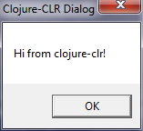
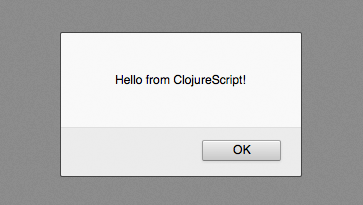
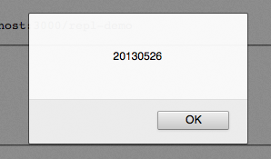
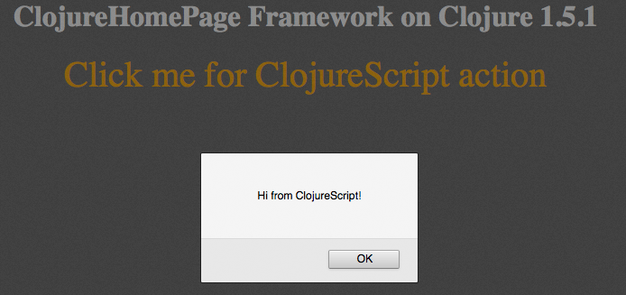

## プラットフォーム

とうとう最後の章にたどり着きました。 この本では、ここまでClojureの持つ色々な可能性について見てきました。

ここでは、Clojureのスコープを広げてみましょう。 今まではJavaのVM上でClojureを動かしてきました。 でも、もしかしたらClojureを使いたいけどJVMは使えないとか、あるいはClojureのコードをまったく違う環境で再利用したいということがあるかも知れません。

この最後の章では、まずRougeを使ってRubyのVM上でClojureのコードを動かし、その次にMicrosoft .NetのVMでシームレスにClojureを動かします。 最後は、coffeescriptのようなクールな存在になるかもしれない、JavaScriptのランタイムで動かせる新顔のClojurescriptについて。

### Ruby + Clojure = Rouge !

もしかしたら、Rougeはこの本の第1章で紹介すべきだったかも知れません。 マジで興味深いです。 以前、開発チームに質問を投げたことがありますが、彼らは即座に対応し1時間かからずに問題を修正してくれました。

なぜRougeか？

[Rouge](http://rouge.io/)はRuby VM上のClojureで2つの特長があります:

* ブートが速い (私の環境では 0.1秒)
* Rubyのgemが使える ＝ 現代的で優れたAPIが多い
* Clojure は素晴らしい！

#### はじめの一歩

RougeのREPLをオンラインで試すことが出来ます：[Try Rouge](http://try.rouge.io/)
あるいは、gemでローカルにインストールすることが出来ます:

    gem install rouge-lang
    rouge

これでとりあえずRougeでREPLが動くようになりました。

ま、まずは最初のサンプルを動かしてみましょう:

@@@ ruby chapter10/rouge/first.rg @@@

まったくもってClojureそのものですね！ そして速い！

じゃ、どんどん行きます。

#### Teenager: Clojureでgem

##### WebをMechanizeする

RubyにはMechanizeという素晴らしいgemがあります。

MechanizeライブラリはWebサイトとのやり取りを自動化するのに使われます。 Mechanizeは自動的にcookieの保存/送信、リダイレクト処理、リンクを辿ったり、フォーム送信等を行います。 フォームの項目も生成し送信します。 また、Mechanizeは訪問したサイトの履歴も取得します。

それでは、ClojureからMechanizeを使ってみましょう。

まず、gemをインストールします:

    gem install mechanize

これで、コードから直接参照出来るようになります:

@@@ ruby chapter10/rouge/mechanize-rg/test.rg @@@

以下のコマンドで実行してみましょう:

    rouge test.rg

コードの中身はJavaの時とそれほど変わりませんが、メソッドの参照はVM(この場合はRuby)の作法に従って'.'(ドット)表記を使っています。

##### Rubyのイベント

速くてシンプルなRubyプログラム用のイベント処理ライブラリ[eventmachine](http://rubyeventmachine.com/)をインストールします。

    gem install eventmachine

以下のように、ネームスペースの中にラッパーを書きます:

@@@ ruby chapter10/rouge/em-rg/em-rg.rg @@@

すると、ネームスペース定義の中で以下のようにいつもの*require*ディレクティブを使うと、このラッパーを参照することが出来ます:

    (:require [em-rg :as em])

@@@ ruby chapter10/rouge/em-rg/test.rg @@@

仕掛けたRubyタイマーによって、以下のテキストが表示されます:

    2013-05-24 18:35:02 +0900 Execution begins.
    2013-05-24 18:35:03 +0900 First timer.
    2013-05-24 18:35:04 +0900 Bye bye.

Ruby VMの起動の速さとClojureの独創的なスクリプティングとの組み合わせをぜひ楽しんでください。

### ClojureCLR (.NetでClojure)

[Clojure CLR](https://github.com/richhickey/clojure-clr)はClojureをMicrosoftのCLR(Common Language Runtime)または.Netに移植したものです。

ClojureCLRはC#(とClojure自身)で書かれており、MicrosoftのDLR(Dynamic Language Runtime)を使用しています。

#### 始めよう

Webサイトによると、ClojureCLRにはいくつかのゴールがあります:

 -- 使えるClojureをCLR/DLR上に実装する
 -- JVM実装版と同等か限りなく近いものにする
 -- 楽しいものにする

ClojureCLRを始めるために、ローカルPCにはモチロン! [.NET](http://www.microsoft.com/ja-jp/download/details.aspx?id=17851)が必要です。

[Getting the binaries](https://github.com/clojure/clojure-clr/wiki/Getting-binaries)を参考に、バイナリーファイルをダウンロードし、展開し、展開したフォルダに行ってClojure.Main.exeを実行してREPLを起動します。

以下は展開したフォルダです:

そして、REPLを実行したところです:

#### .Netの最初の一歩

ClojureCLRのチュートリアルは[blog entry](http://www.myclojureadventure.com/2011/10/getting-started-with-clojure-clr.html)をベースにしています。

さて、REPLが実行出来るようになったので、いくつか.Netを呼び出してみましょう。 最初に呼び出すのはConsole.WriteLineです。 System.ConsoleがREPLによって自動的にロードされるので、Console.WriteLineは以下のようにして直接呼び出すことが出来ます:

    (System.Console/WriteLine “I just called a .NET method!”)

.Netのアセンブリを明示的にロードするにはAssembly/LoadWithPartialNameメソッドを使って:

    (System.Reflection.Assembly/LoadWithPartialName "System.Windows.Forms")

か、またはLoadメソッドを使います。 どちらの場合も表示されるメソッドの実行結果は同じです。 もし、アセンブリの特定のバージョンをロードする必要がある婆にはLoadメソッドを使います。 私は、それ以外の場合にはLoadWithPartialNameメソッドを使います。

さて、せっかくSystem.Windows.Formsをロードしたので、それをネームスペースに追加してMessageBoxを使ってみましょう。
REPLで以下のように入力します:

    (import (System.Windows.Forms MessageBox))

上記は、System.Windows.Forms.MessageBoxをネームスペースに持ってくるようREPLに伝えます。 これによって、System.Windows.Forms.MessageBox/Showの代わりにMessageBox/Showで呼び出すことが出来るようになります。 それでは試しに以下のコマンドを入力してみましょう。

    (MessageBox/Show “Hi from clojure-clr!” “Clojure-CLR Dialog”)

以下のようなダイアログが表示されるはずです。

単純明解ですよね？

#### .NETからClojureを呼ぶ

ここでは、非常に分かりやすいので[answer on StackOverflow](http://stackoverflow.com/questions/4380054/calling-clojure-from-net)の内容を基に説明したいと思います。

まず、次のClojureコードがあるとします:

    (ns hello
      (:require [clojure.core])
      (:gen-class
       :methods [#^{:static true} [output [int int] int]]))
    (defn output [a b]
      (+ a b))
    (defn -output [a b]
      (output a b))
    (defn -main []
      (println (str "(+ 5 10): " (output 5 10))))

[Command window](http://code.google.com/p/conemu-maximus5/)で以下のコマンドを実行して上記コードをコンパイルします。

    Clojure.Compile.exe hello

コンパイルが完了すると、下記ファイルが生成されます:

* hello.clj.dll
* hello.clj.pdb
* hello.exe
* hello.pdb

hello.exeを起動すると、上記-main関数が実行されます。

    C:\Users\niko\Desktop\Debug 4.0>hello.exe
    (+ 5 10): 15

今度は上記のコードをC#のプログラムから呼び出してみましょう。 次のモジュールへの参照を追加します: Clojure.dll、hello.clj.dll、hello.exe

C#のコードは以下の通りです。

    using System;
    namespace ConsoleApplication1
    {
        class Program
        {
            static void Main(string[] args)
            {
                hello h = new hello();
                System.Console.WriteLine(h.output(5, 9));
                System.Console.ReadLine();
            }
        }
    }

ご覧の通り、Clojureで書いたhelloクラスを、.Netアプリケーションから使用することが出来ます。

※ アプリケーションを実行するためには、環境変数clojure.load.pathにClojureのバイナリーファイルへのパスを設定する必要があります。

#### Lein CLR: Leinigenで.Netをもっと便利にする

.Netを便利に使うためのLeiningenのプラグインがあります。

[lein-clr](https://github.com/kumarshantanu/lein-clr)はClojureCLRプロジェクトのビルド処理を自動化するLeiningenのプラグインです。 このプラグインは.Netと[Mono](http://www.mono-project.com/Main_Page)で使えます。

通常のLeiningen 2 プラグインとしてインストールします:

    :plugins [[lein-clr "0.2.0"]]

次に、新規CLRプロジェクトを作成します:

    lein new lein-clr clr-test

CLRがインストールされている場所を環境変数に設定します:

    set CLJCLR14_40=\Users\niko\Desktop\Debug 4.0

以下のコマンドでテストを実施します:

    lein clr test

コンソールに以下のような出力が表示されます:

    Testing foo.core-test

    FAIL in (a-test) (:)
    FIXME, I fail.
    expected: (= 0 1)
      actual: (not (= 0 1))

    Ran 1 tests containing 1 assertions.
    1 failures, 0 errors.
    {:type :summary, :test 1, :pass 0, :fail 1, :error 0}

Leiningen CLR プラグインはClojureプロジェクトの下記タスクをカバーします:

    lein clr [-v] clean
    lein clr [-v] compile
    lein clr [-v] repl
    lein clr [-v] run [-m ns-having-main] [arg1 [arg2] ...]
    lein clr [-v] test [test-ns1 [test-ns2] ...]

Clojure CLRの基本部分の説明は以上です。 お気に入りのClojureアプリケーションをWindows/.Net環境で動かすきっかけとなれば幸いです。

### ClojureScript (ClojureをJavascriptにコンパイル)

[ClojureScript](https://github.com/clojure/clojurescript)はJavaScriptに対するClojureの答えで、最近ではおそらく最も活発なプロジェクトです。
ClojureScriptはJavaScriptをターゲットとするClojure用の新しいコンパイラで、Google Closure最適化コンパイラのAdvencedモード互換なJavaScriptを出力します。

[This page](http://himera.herokuapp.com/synonym.html) にはClojureScriptとJavaScriptとの比較が掲載されていますので、まず目を通すことをお勧めします。

また、すぐに使えるオンラインのREPL[online REPL](http://www.clojurescript.net/)があります:

    http://www.clojurescript.net/

もし、ClojureScriptの構文や書式について知りたいのであれば、何冊かの本があるようです。 ま、どちらかというと、書式よりもClojureScript周りのエコシステムの方が興味あると思いますが。

#### 最初のClojureScriptプロジェクト

まずは、シンプルなRingアプリケーションを使ってClojureScriptに統合してみたいと思います。 Ring覚えてますか？ もしかしたら、Webの章をサラっと見直す良い機会かも知れません。

*project.clj* ファイルを見てみましょう:

@@@ ruby chapter10/cljs-simple/project.clj @@@

新しいLeiningenプラグインlein-cljsbuildを設定しています:

    [lein-cljsbuild "0.3.2"]

また、ClojureScript用の新しいセクションがあります:

    :cljsbuild {
      :builds [{:source-paths ["src-cljs"]
              :compiler {:output-to "resources/public/js/main.js"
                         :optimizations :whitespace
                         :pretty-print true}}]}

cljsbuildセクションの中身は、*src-cljs*フォルダにあるすべてのClojureScriptコードをコンパイルし、*main.js*というファイルに出力するという指定をしています。 また、ファイルに出力するときにいくつかの書式オプションを付けています。

cljs-simpleプロジェクトフォルダで、以下のコマンドでClojureScriptがバックグラウンドでコンパイルされます:

    lein cljsbuild auto

*src-clj*内の通常のClojureコードは特に目新しいものが無いので、src-cljs/example/hello.cljを見てみましょう:

@@@ ruby chapter10/cljs-simple/src-cljs/example/hello.clj @@@

とりあえず基本的なコードです。 このファイルはコンパイルされて、*project.clj*で指定された通常のJavaScriptファイルに出力されます。

では、Ringサーバ(覚えていますか？)を起動しましょう:

    lein ring server-headless

ブラウザでローカルのURLにアクセスします: [http://localhost:3000](http://localhost:3000).

期待通りの画面が表示されましたか？:

*hello.cljs*のメッセージ部分を少し変えてみましょう:

    (js/alert "おはよう ClojureScript!")

ターミナルの*lein cljsbuild auto*コマンドがまだバックグラウンドで実行されているので、上記の変更はコードを保存すると更新されます:

ブラウザの表示を更新すると、変更が反映されます:

これで、初めてのClojureScriptプロジェクトが動きました。

#### ブラウザでライブスクリプト！

次はもう一歩踏み込んだサンプルを紹介しましょう。 lein-cljsbuildのサンプルで、プロジェクトは*chapter10/cljs-advanced*にあります。

##### サーバとクライアントでコードをシェアする

*project.clj*ファイルを見てみると、ずいぶん行数が多いですね。。 でも心配することはありません。 これは色々なシナリオに対応しようとしているからで、通常のアプリケーションであればすべてを記述する必要はありません。

*project.clj*ファイルで次に目がつくのは、以下の2行です:

    :crossovers [example.crossover]
    :crossover-jar true

この2行でクライアント側(JavaScriptにコンパイルされる)とサーバ側(最終的にはJavaとして実行される)の両方で使われるClojureコードのネームスペースを定義しています。

サーバを起動します:

    lein ring server-headless

サーバのページにアクセスすると:

でも、*src-cljs*フォルダの中にはこのポップアップで表示されているコードは見当たりません。。どこにあるんでしょう？
実はClojureのソース・パスである*src-clj*の中で定義されています。

@@@ ruby chapter10/cljs-advanced/src-clj/example/crossover/shared.clj @@@

ポップアップのコードはここから来ているのです。 でもどうやって？

HTMLのソースを見てみると、以下の部分があります:

    
    

このHTMLはRingのハンドラーによってサーバーサイドで生成されます。 そこで、Ringの通常のviewパスを見てみると*views.clj*の中に移管おコードがあります:

    (defn- run-clojurescript [path init]
     (list
      (include-js path)
      (javascript-tag init)))

    (defn index-page []
     (html5
      [:head
        [:title (shared/make-example-text)] ]
      [:body
        [:h1 (shared/make-example-text)]
         (run-clojurescript
          "/js/main-debug.js"
          "example.hello.say_hello()")]))

これを見ると、*hello.cljs*ファイルをチェックする必要がありそうです:

    (ns example.hello
      (:require
        [example.crossover.shared :as shared]))

    (defn ^:export say-hello []
       (js/alert (shared/make-example-text)))

これで一気にすべてがつながりました。 ちょっと図にしてみましょう:

共有コードセクションもすぐに反映されるので、*shared.clj*ファイルに変更して:

    (defn make-example-text []
      (macros/reverse-eval
        ("code" "shared " "from the " "おはよう " str)))

ブラウザをリロードすると、変更が即座に反映されます:

以上がアドバンスコースの最初のレッスンです。 まだまだいけそうですね！

##### ClojureScript REPLをブラウザにつなげる

前のセクションで実行した2つのLeiningenコマンド、1つはバックグラウンドでClojureScriptをコンパイル:

    lein cljsbuild auto

と、もう1つはサーバの起動でした:

    lein ring server-headless

これらを実行した状態で、ブラウザから別のページにアクセスします:

    http://localhost:3000/repl-demo

サーバーサイドで興味深いコードは、またまたviews.cljファイルの*repl-demo-page*関数です。

    (run-clojurescript
        "/js/main-debug.js"
        "example.repl.connect()")

これで、このClojureScriptコードがexample/repl.cljsから来ていることが分かりました:

@@@ ruby chapter10/cljs-advanced/src-cljs/example/repl.clj @@@

ロード時にREPLへコネクトしています！ では、このクライアントに*listen*してみましょう:

    lein trampoline cljsbuild repl-listen

コネクトしましたね！ クライアントとサーバーがREPLでつながりました。 表示されているように、何かREPLのコマンドを試してみましょう。 例えば、ClojureScript REPLに以下のコマンドを入力して結果を見てみましょう:

    (js/alert "Hello!")

    (load-namespace 'goog.date.Date)
    (js/alert (goog.date.Date.))

    (.log js/console (reduce + [1 2 3 4 5]))

    (load-namespace 'goog.dom)
    (goog.dom.setTextContent (goog.dom.getElement "fun") "おはようございます!")

以下のようにメッセージが切り替わります:

ワクワクしますね！

##### PhantomJSでテスト

前のトピックではブラウザで入力されたコードを扱いました。 今回はこれをブラウザ無しでやってみましょう。

ここでは、JavaScriptが使えるヘッドレスなWebKitである[PhantomJS](http://phantomjs.org/download.html)を使います。 PhoantomJSは速くて様々なWebのスタンダードをサポートします: DOM、CSS、JSON、Canvas、SVG等
基本的にPhantomJSは画面がない以外は普通のブラウザ出来ることはほとんど出来ます。

Leiningenのcljsbuildのrepl-launchコマンドは、REPLを起動し、REPLにコネクトするカスタムコマンドを実行します。 次のコマンドを実行して:

    lein trampoline \
    cljsbuild repl-launch \
    phantom http://localhost:3000/repl-demo

コマンドプロンプトでREPLがスタートし、PhantomJSにREPLにコネクトするよう伝えます。
つまり、ブラウザの画面が無いことを除けば、これは前のセクションでやったことと同じ状態です。

phantomはプロジェクトの*project.clj*ファイルの中で定義されています:

         ; This is similar to "firefox" except it uses PhantomJS.
         ; $ lein trampoline cljsbuild repl-launch phantom <URL>
         "phantom" ["phantomjs"
                  "phantom/repl.js"
                  :stdout ".repl-phantom-out"
                  :stderr ".repl-phantom-err"]

これで、REPLに次のClojureScriptを入力すれば:

    ClojureScript:cljs.user> (js/console.log "ありがとう")

*.repl-phantom-out*ファイルのPhantomJSのコンソールログにメッセージが表示されます。 こんな感じで:

    Loading URL: http://localhost:3000/repl-demo
    Loaded successfully.
    App console: ありがとう

前のセクションで試したコマンドも同じように動きます。 例えば以下のように入力すれば:

     (.log js/console (reduce + [1 2 3 4 5]))

は、上記のファイルに同じように結果が出力されます:

    App console: 15

##### Clojure Script 最初の一歩: まとめ

ここまでをまとめると、

* RingベースのプロジェクトにClojure Scriptを統合し、実行
* REPLからブラウザにライブでコーディング
* PhantomJSを使ってClojureとClojureScriptでやり取り

ここまでの内容だけでも、色々なアイディアが浮かんでくるのではないでしょうか？

#### WebサイトをClojureで

まずは、Clojure Home PageというClojureのフレームワークを使って、Clojure Scriptとテンプレートのパワーに触れてみましょう。

その後は、GoogleのAngularJSコードをClojure　Scriptの中で書いてみましょう。

##### Clojure Home Page

[Clojure Home Page](https://github.com/runexec/chp)はCompojureベースのフレームワークで、フロントエンドとバックエンドをClojureで書くことが出来ます。

Clojure Home Pageで出来ること:

* <clj></clj>タグを使ってHTMLの中でClojureを走らせる
* 複数のメソッドハンドラを使える: get、post、put、delete、head
* コモンWebヘッダーの取得: ($ user-agent)とか
* Webヘッダーの取得: ($$ cache-control)とか
* 環境変数の取得: (env java.vm.name)とか
* Hiccupフォームを使ったHTML置換
* ClojureScriptを使ってJavaScript/ECMAScript生成
* Gardenを使ったCSS生成
* KormaSQLを使ったデータベース操作

*clojure-home-page*のリポジトリからサンプルをクローンして見てみたところ、今やお馴染みの2つのコマンドからスタートします:

    lein ring server-headless
    lein cljsbuild auto

このプロジェクトでは、*chp-route*という新しい識別子が登場します:

    (chp-route "/"
               (or (chp-parse (str root-path "index.chtml"))
                   "error"))

これによって、index.chtmlファイルに直接Clojureのコードを埋め込むことが出来るようになります。

ファイルの拡張子は.chtmlで、cljタグに挟まれてClojureのコードが埋め込まれています:

@@@ ruby chapter10/clojure-home-page/chp-root/index.chtml @@@

ファイルにはClojureコードが埋め込まれ、別のファイルはClojure Scriptが書かれ、どこでもClojureという感じですね！

@@@ ruby chapter10/clojure-home-page/resources/cljs/main.cljs @@@

Clojure Home Pageはテンプレート用に[hiccup](https://github.com/runexec/chp#clojure-and-html-generation)をラップしており、CSS用に[Garden](https://github.com/noprompt/garden)ライブラリを使用しています。

##### Fetch: クライアント/サーバー間のやり取りを手軽に行うClojureScriptライブラリ

Webの章ではnoirというライブラリを使いました。

[Fetch](https://github.com/ibdknox/fetch)の*Remotes*はXHR無しにnoirサーバの呼び出しを可能にします。 クライアント側では、以下のようなコードを書きます:

    (ns playground.client.test
     (:require [fetch.remotes :as remotes])
     (:require-macros [fetch.macros :as fm]))

    (fm/remote (adder 2 5 6) [result]
     (js/alert result))

    (fm/remote (get-user 2) [{:keys [username age]}]
     (js/alert (str "Name: " username ", Age: " age)))

     ;; for a much nicer experience, use letrem
    (fm/letrem [a (adder 3 4)
              b (adder 5 6)]
      (js/alert (str "a: " a " b: " b)))

※ クライアント側で取得するのはJSONではなく、正にClojureのデータ構造なのでClojureコードの中でそのまま扱うことができます。

noir側もシンプルにdefremoteを使ってリモートを定義しています。

    (use 'noir.fetch.remotes)

    (defremote adder [& nums]
               (apply + nums))

    (defremote get-user [id]
               {:username "Chris"
                :age 24})

    (server/start 8080)

friendlyとfetchのサンプルは*friendly-fetch-example*フォルダにあります。

以下、サーバー側のポイントとなる部分です(抜粋):

    (ns friendly.views.welcome
      (:require [friendly.views.common :as common]
                [cemerick.friend :as friend])
      (:use [noir.fetch.remotes]
            [noir.core :only [defpage]]))

    (defremote get-user []
      (:username (friend/current-authentication)))

    (defremote login [auth]
      (friend/authorize #{:friendly.server/user}
                        (:username (friend/current-authentication))))

    (defremote logout [] nil)

    (defremote another []
      (friend/authorize #{:friendly.server/user} "This action required logging in!"))

そしてクライアント側。 ClojurescriptからClojureを呼び出しています:

@@@ ruby chapter10/friendly-fetch-example/src-cljs/friendly/client.cljs @@@

また、Googleのdomライブラリを使ってDOMを直接更新しています:

    (dom/setTextContent (dom/getElement "currentuser") "")

##### Shoreleave

これ抜きにはClojurescriptは語れないってくらい重要なShoreleaveを紹介します。

[Shoreleave](https://github.com/ohpauleez/shoreleave)で、ClojureScriptをクライアントサイドでよりスマートに使うことができます。 Shoreleaveは下記にフォーカスしたライブラリのコレクションです:

    セキュリティ
    慣用的なインターフェイス
    クライアントサイド方式
    HTML5の機能
    ClojureScript

もっと簡単に言うと、ShoreleaveはRing/CompojureベースのバックエンドにコネクトするClojurescriptベースのクライアントWebアプリケーションに有用なライブラリセットです。

メインのRingハンドラーファイルには3つの興味深いセクションがあります。

1つ目: shoreleave middlewareは以下のネームスペースで定義されている:

    [shoreleave.middleware.rpc :refer [defremote wrap-rpc]]

2つ目: それをルート定義に追加:

    (def app
      (-> app-routes
      wrap-rpc
      ...
      handler/site))

3つ目: リモートのエンドポイントを定義:

     ;; https://github.com/shoreleave/shoreleave-remote-ring
     (defremote ping [pingback]
       (str "You have hit the API with: " pingback))

これで、リモートのエンドポイントはクライアントサイドから使用できるようになる:

@@@ ruby chapter10/barebones-shoreleave/src/barebones_shoreleaves/client/main.cljs @@@

ShoreleaveのremotesパッケージにはXHR、Pooled-XHR、JSONP、HTTP-RPCの機能が含まれています。

Clojureサーバがring-anti-forgery middlewareを使用しているのであれば、CSRFプロテクションが組み込まれています。 anti-forgeryの詳細はshoreleave-baselineを参照して下さい。

HTTP-RPCは単一のサーバーサイドの呼び出し、remote-nsによって、クライアント側APIとしてサーバーサイドのネームスペースを出します。

最後に、Shoreleaveは[pub/sub abstraction](https://github.com/ohpauleez/shoreleave#a-pubsub-abstraction-and-implementations)が含まれています。

Shoreleaveのpub/subシステムを使って、アプリケーションのパーツを完全に分離し、宣言的にそれらをバインドすることができます。 そうすることで、既存のサービスを組み合わせて新しい機能を構築することが出来ます。

[barebone shoreleave](https://github.com/ddellacosta/barebones-shoreleave) を第10章のフォルダに含めました。

第10章のshoreleaveフォルダには、他にもいくつかのShoreleaveサンプルがあります。

##### ここから先へ

このセクションでやったこと:

* Clojure Home Page: WebアプリケーションのフロントエンドでClojureを使う、Ringハンドラーを使ったバックエンド
* Fetch: サーバとクライアントでリモートでClojureのファンクションをやり取りするライブラリ
* Shoreleave: クリーンなリモートインターフェイス、pub/subフレームワーク

Clojure scriptの更なるトピックとしては、以下のライブラリがあります:

###### Enfocus

[enfocus](https://github.com/ckirkendall/enfocus)はEnliveに触発されたClojure Script用テンプレートです。

[enfocus-site](http://ckirkendall.github.io/enfocus-site/)の[source code](https://github.com/ckirkendall/enfocus-demo-site.git)そのものが非常に良いリファレンスとなっています。

###### Domina

[Domina](https://github.com/levand/domina)はjQueryにインスパイアされたDOM操作ライブラリです。 Google ClosureライブラリによるDOM操作に対するClojure用のインターフェイスを提供します。
また、DominaにはGoogle Closureのイベントハンドリングをラップした強力なAPIがあります。

###### ClojureScriptとCanvas: シンプルなブロック崩しの実装

HTML5のCanvasを使ってブロック崩しをClojure scriptで実装しています: [post](http://nakkaya.com/2012/01/31/clojurescript-canvas-a-simple-breakout-implementation/)

スクリーンショットはこちら:

もう一冊本が書けそうですね!

#### ボーナス: ClojurescriptでGoogle AngularJS

[Clang](https://github.com/pangloss/clang)は、ClojureScriptと[Google's AngularJS framework](http://angularjs.org/)を統合します。

##### Clangとは?

ClangにはAngularJSの変更していない現在のリリースが含まれており、AngularアプリケーションからClojure Scriptのデータ構造を使えるようになるので、コントローラやディレクティブを簡潔に書くことが出来ます。 ClangはClojureScriptをAngularにビルトインされているディレクティブに統合します。

Clangは、Angularがスコープからプロパティを読み込むときに使われる新しい$parseプロバイダーを定義します。 また、Angularの$interpolateプロバイダーをアプリケーション中の{{interpolated}}ブロックの中身と置き換えます。

これら2つの変更でJavaScriptのアレイと見なされるng-repeatを除くすべてのAngularのビルトイン・ディレクティブを有効にします。 ng-repeatはClangのclang-repeatが対応します。

##### サンプル

以下、サンプルのindex.htmlの抜粋です。

ここでは、スコープからremainingファンクションを呼び出し、todosベクタに対してcountビルトイン・ファンクションを実行しています:

      {{(remaining)}} of {{(count todos)}} remaining
      [ <a ng-click="(archive)">archive</a> ]

関連するコントローラの定義部分:

    (def.controller m TodoCtrl [$scope]
     (scope! todos [{:text "learn angular" :done "yes"}
                 {:text "learn cljs" :done "yes"}
                 {:text "build an app" :done "no"}])
     (defn.scope remaining []
      (->>
       (scope! todos)
       (map :done)
       (remove #{"yes"})
       count)))

次の部分では、動的にテーブルを作り上げています:

      <table>
        <tr clang-repeat="group in (drop 1 (partition 3 nums))">
          <td clang-repeat="x in (map (juxt identity odd?) group)">
            {{(first x)}} is {{(if (last x) "odd" "even")}}
          </td>
        </tr>
      </table>

そのコントローラ部分:

    (def.controller m TodoCtrl [$scope]
     (scope! nums (range 1 10)))

###### 自分で試す

clangのフォルダで、cljsbuildコマンドを使ってコンパイルします:

    lein cljsbuild auto dev

コンパイルされたコードをopenする:

    open resources/public/index.html

ブラウザで表示する:

### この章でやったこと

この最後の章では、本来のClojureとはちょっと別の世界を紹介しました。

* RubyのVMでClojureを動かし、Ruby gemをClojureから呼び出す
* .NetでClojureを動かし、Clojureから.Netのコードを呼ぶ
* Clojurescriptを動かし、WebプログラミングでClojureを使う

飲み残したワインはないですか？ もう最後の章なので、新しいボトルを開けるのもアリですね。
